```
# Technical Specification

# 1. INTRODUCTION

## 1.1 Executive Summary

The ai_umbrella project is an enterprise-grade insurance domain application that combines sophisticated backend services with a modern user interface to deliver comprehensive insurance management capabilities. <span style="background-color: yellow">The system has undergone significant modernization, leveraging Java 21 (LTS) and Spring Boot 3.2.x, including a strategic migration from javax.* to jakarta.* packages to align with modern enterprise Java standards</span>.

<span style="background-color: yellow">The modernized architecture utilizes Spring Boot's embedded Apache Tomcat 10.1.18, enabling streamlined deployment and enhanced container orchestration capabilities. The system takes advantage of Java 21's Virtual Threads, significantly improving application performance and resource utilization under high concurrent loads</span>.

The system addresses critical business needs in policy management, underwriting, rating, claims processing, billing integration, and document management. <span style="background-color: yellow">These technical enhancements provide the foundation for superior scalability, improved response times, and optimized resource utilization, further strengthening the system's enterprise-grade capabilities</span>.

The project solves core business challenges by providing:
- Integrated policy lifecycle management
- Automated underwriting workflows
- Real-time rating capabilities
- Streamlined claims processing
- Seamless third-party system integration
- Comprehensive document handling
- <span style="background-color: yellow">Enhanced performance through modern Java features</span>
- <span style="background-color: yellow">Simplified deployment and maintenance</span>

Key stakeholders include insurance carriers, underwriters, claims processors, and policy administrators. The system delivers value through <span style="background-color: yellow">modernized infrastructure</span>, process automation, risk assessment optimization, and enhanced operational efficiency across the insurance value chain.

## 1.2 System Overview

### Project Context
The ai_umbrella system positions itself as a comprehensive insurance management platform within the enterprise landscape. It integrates with critical business systems including PolicySTAR Export, RMV (Registry of Motor Vehicles), SpeedPay for payments, and CLUE Property for claims processing.

### High-Level Description
The system architecture consists of two primary components, built on a <span style="background-color: yellow">modern, cloud-ready technology stack</span>:

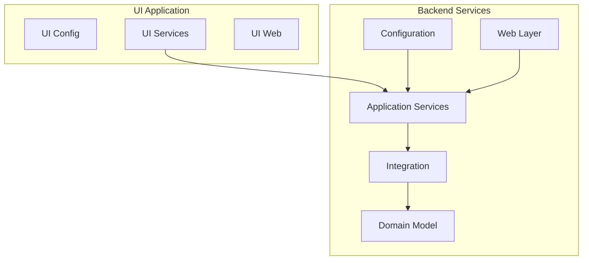

Key architectural decisions include:

- \<span style="background-color: yellow"\>Modern application framework utilizing Spring Boot 3.2.x (based on Spring Framework 6.1.x) with Java 21, emphasizing auto-configuration and container-first design principles\</span\>
- \<span style="background-color: yellow"\>Migration from javax.\* to jakarta.\* packages, ensuring alignment with current Jakarta EE specifications and cloud-native deployment readiness\</span\>
- \<span style="background-color: yellow"\>Embedded Apache Tomcat 10.1.18 server, providing simplified deployment and native support for Virtual Threads\</span\>
- Modular design with clear separation of concerns
- RESTful service architecture
- Robust integration capabilities through Apache CXF
- Persistent layer optimization using MyBatis
- Comprehensive logging through Log4j2

### Success Criteria

Measurable objectives include:

- System response time \< 2 seconds for 95% of transactions
- 99.9% system availability
- Successful integration with all identified third-party systems
- Complete audit trail for all insurance transactions

## 1.3 Scope

### In-Scope Elements

#### Core Features and Functionalities

- Policy management and administration
- Automated underwriting processes
- Real-time rating engine integration
- Claims processing workflows
- Billing system integration
- Document management services

#### Implementation Boundaries

- System Integration Points:
  * PolicySTAR Export System
  * Billing Systems
  * Document Services
  * RMV Integration
  * Payment Processing (SpeedPay)
  * Claims Systems (CLUE Property)
  * Underwriting Services

### Out-of-Scope Elements

- Mobile application development
- Direct consumer-facing portals
- Legacy system migration tools
- Third-party system development
- Custom reporting engine development
- Real-time chat support
- Offline processing capabilities

# 2. PRODUCT REQUIREMENTS

## 2.1 Feature Catalog

### Core Policy Management

#### F-001: Policy Administration

- **Category**: Core Business Function
- **Priority**: Critical
- **Status**: Completed
- **Description**: Comprehensive policy lifecycle management including creation, modification, and termination
- **Business Value**: Streamlines policy operations and reduces manual intervention
- **Dependencies**:
  * Integration with PolicySTAR Export
  * Document management services
  * Rating engine integration

#### F-002: Underwriting Automation

- **Category**: Process Automation
- **Priority**: Critical
- **Status**: Completed
- **Description**: Automated underwriting workflows with rule-based decision support
- **Business Value**: Reduces underwriting time and improves risk assessment accuracy
- **Dependencies**:
  * RMV integration
  * CLUE Property integration
  * Business rules engine

#### F-003: Claims Processing

- **Category**: Core Business Function
- **Priority**: High
- **Status**: Completed
- **Description**: End-to-end claims management workflow
- **Business Value**: Accelerates claims resolution and improves customer satisfaction
- **Dependencies**:
  * CLUE Property integration
  * Document management services
  * Payment processing integration

## 2.2 Functional Requirements

### Policy Administration Requirements

| Requirement ID | Description | Priority | Complexity |
| --- | --- | --- | --- |
| F-001-RQ-001 | System must support policy creation with complete validation | Must-Have | High |
| F-001-RQ-002 | Support real-time policy modifications and endorsements | Must-Have | Medium |
| F-001-RQ-003 | Enable policy export to PolicySTAR system | Must-Have | Medium |

### Underwriting Requirements

| Requirement ID | Description | Priority | Complexity |
| --- | --- | --- | --- |
| F-002-RQ-001 | Automated risk assessment based on RMV data | Must-Have | High |
| F-002-RQ-002 | Integration with CLUE Property for claims history | Must-Have | Medium |
| F-002-RQ-003 | Support for manual underwriting override | Should-Have | Low |

### Claims Processing Requirements

| Requirement ID | Description | Priority | Complexity |
| --- | --- | --- | --- |
| F-003-RQ-001 | End-to-end claims workflow management | Must-Have | High |
| F-003-RQ-002 | Integration with SpeedPay for claims payments | Must-Have | Medium |
| F-003-RQ-003 | Document upload and management for claims | Must-Have | Medium |

## 2.3 Feature Relationships

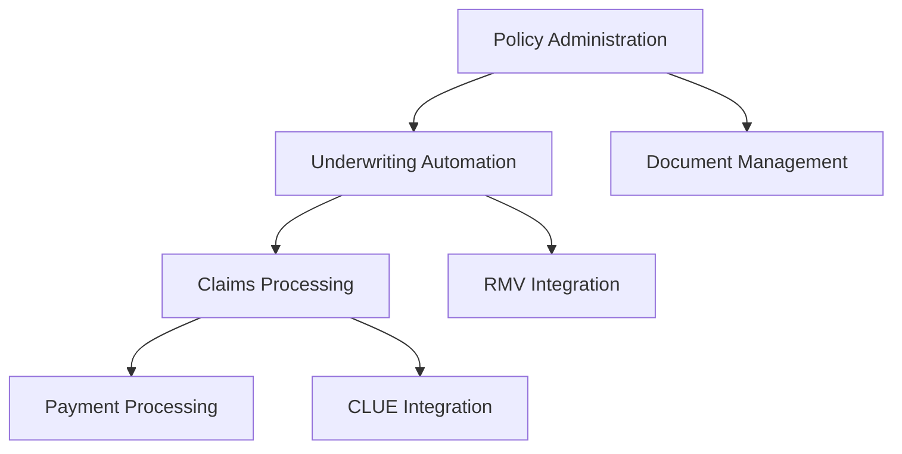

## 2.4 Implementation Considerations

### Technical Constraints

- \<span style="background-color: yellow"\>JDK 21 compatibility required\</span\>
- \<span style="background-color: yellow"\>Spring Boot 3.2.x with an embedded Apache Tomcat 10.1.18 deployment environment, supporting auto-configuration and container-friendly deployment\</span\>
- Maven 3.6.3 build system
- \<span style="background-color: yellow"\>Spring Boot 3.2.x (built on Spring Framework 6.1.x) with migration from javax.\* to jakarta.\* packages\</span\>

### Performance Requirements

- Response time \< 2 seconds for standard operations
- Support for EhCache caching
- \<span style="background-color: yellow"\>Leverages Java 21's Virtual Threads for improved parallel processing and enhanced performance under high concurrent loads\</span\>
- JGroups clustering for high availability
- Disruptor framework for high-performance queuing

### Security Considerations

- OWASP ESAPI 2.5.2.0 integration
- Hibernate Validator implementation
- Structured logging with Log4j2 ECS layout
- JBoss security configuration compliance

### Scalability Requirements

- \<span style="background-color: yellow"\>Container orchestration and auto-scaling capabilities enabled by Spring Boot deployment model\</span\>
- \<span style="background-color: yellow"\>Dynamic scaling through container orchestration platforms\</span\>
- \<span style="background-color: yellow"\>Built-in load balancing and service discovery support\</span\>
- Caching strategy using EhCache
- Connection pooling optimization
- Asynchronous processing capabilities

### Maintenance Requirements

- Regular security patches and updates
- Performance monitoring and optimization
- Database maintenance procedures
- Log rotation and archival
- Configuration management across environments

## 2.5 Traceability Matrix

| Feature ID | Business Requirement | Technical Component | External Dependency |
| --- | --- | --- | --- |
| F-001 | Policy Management | umbrella-services | PolicySTAR Export |
| F-002 | Underwriting | umbrella-appservices | RMV, CLUE Property |
| F-003 | Claims Processing | umbrella-integration | SpeedPay |

# 3. TECHNOLOGY STACK

## 3.1 Programming Languages

### Primary Backend

- **\<span style="background-color: yellow"\>Java 21 (LTS)\</span\>**
  - \<span style="background-color: yellow"\>Core platform for all backend services and business logic, leveraging modern language features\</span\>
  - \<span style="background-color: yellow"\>Selected for enhanced performance through Virtual Threads, enabling efficient handling of concurrent operations\</span\>
  - \<span style="background-color: yellow"\>Provides improved scalability and resource utilization in high-load enterprise environments\</span\>
  - \<span style="background-color: yellow"\>Ensures forward compatibility with modern cloud-native deployment patterns\</span\>

Key benefits of the Java 21 platform include:

- \<span style="background-color: yellow"\>Virtual Threads for lightweight concurrency and improved throughput\</span\>
- \<span style="background-color: yellow"\>Pattern matching for switch expressions and records\</span\>
- \<span style="background-color: yellow"\>Enhanced garbage collection with generational ZGC\</span\>
- \<span style="background-color: yellow"\>Improved startup time and reduced memory footprint\</span\>

The backend services architecture leverages these capabilities through:

- \<span style="background-color: yellow"\>Structured concurrency for better resource management\</span\>
- \<span style="background-color: yellow"\>Enhanced type inference and pattern matching for cleaner code\</span\>
- \<span style="background-color: yellow"\>Modern memory management optimizations\</span\>

## 3.2 Frameworks & Libraries

### Core Application Framework (updated)

- **Spring Boot 3.2.x**
  - \<span style="background-color: yellow"\>Built on Spring Framework 6.1.x, providing comprehensive auto-configuration capabilities\</span\>
  - \<span style="background-color: yellow"\>Embedded Apache Tomcat 10.1.18 server for simplified deployment and container operations\</span\>
  - \<span style="background-color: yellow"\>Complete migration from javax.\* to jakarta.\* packages, aligning with modern Jakarta EE standards\</span\>
  - Core capabilities include:
    - \<span style="background-color: yellow"\>Spring WebFlux for reactive programming support\</span\>
    - \<span style="background-color: yellow"\>Spring Native compilation compatibility\</span\>
    - \<span style="background-color: yellow"\>Enhanced Spring Security with modern authentication patterns\</span\>
    - \<span style="background-color: yellow"\>Improved actuator endpoints for monitoring and management\</span\>

### Data Access & Integration

- **MyBatis 3.1.1**
  - MyBatis Spring 1.1.1 integration
  - Provides efficient data persistence layer
  - Supports complex SQL mapping requirements
- **Apache CXF**
  - Enables SOAP/REST service integration
  - Facilitates external system communication

### Utility & Support Libraries

- **Apache Commons Suite**
  - commons-fileupload 1.4 for file handling
  - commons-collections for collection utilities
  - commons-beanutils for JavaBean manipulation
  - commons-dbcp 1.4 for connection pooling
- **Additional Core Libraries**
  - Joda-Time for date/time operations
  - Jackson for JSON processing
  - Log4j2 with ECS layout for structured logging
  - Disruptor framework for high-performance queuing
  - OWASP ESAPI 2.5.2.0 for security controls

### Testing Framework Stack

- **Core Testing Tools**
  - JUnit 4.10 for unit testing
  - Mockito for mocking
  - PowerMock for advanced mocking scenarios
  - MeanBean for bean testing

## 3.3 Databases & Storage

### Primary Databases

- **Microsoft SQL Server**
  - sqljdbc4 3.0.1301.101 driver
  - Primary transactional database
- **IBM DB2**
  - db2jcc 3.59.81 driver
  - Supporting database platform

### Caching Solution

- **EhCache**
  - Integrated with MyBatis (mybatis-ehcache 1.0.1)
  - Provides application-level caching
  - Optimizes database access patterns

## 3.4 Third-Party Services

### Development & Quality Tools

- **SonarQube**
  - Continuous code quality analysis
  - Security vulnerability scanning
  - Code coverage tracking

### Artifact Management

- **Nexus Repository Manager**
  - Release repository: nexus.prcins.net/repository/releases
  - Snapshot repository: nexus.prcins.net/repository/snapshots

### External Service Integrations

- **Insurance Services**
  - PolicySTAR Export for policy management
  - CLUE Property for claims history
- **Government Services**
  - Registry of Motor Vehicles (RMV)
- **Payment Processing**
  - SpeedPay integration

## 3.5 Development & Deployment Infrastructure

### Build & Development Tools

- **Build System**

  - Maven 3.6.3
  - Supports multi-module project structure
  - Manages dependencies and build lifecycle

- **JDK Requirements**

  - \<span style="background-color: yellow"\>Java 21 (Primary runtime environment)\</span\>
  - \<span style="background-color: yellow"\>Supports Virtual Threads and modern language features\</span\>
  - \<span style="background-color: yellow"\>Optimized for containerized deployments\</span\>

### Continuous Integration & Deployment

- **Pipeline Infrastructure**

  - Jenkins Pipeline for automation
  - SonarQube integration for quality gates
  - Nexus artifact deployment
  - \<span style="background-color: yellow"\>Updated build configurations for Java 21 compatibility\</span\>
  - \<span style="background-color: yellow"\>Container image creation and registry integration\</span\>

- **Deployment Automation**

  - \<span style="background-color: yellow"\>Container orchestration platform integration\</span\>
  - \<span style="background-color: yellow"\>Kubernetes deployment manifests\</span\>
  - \<span style="background-color: yellow"\>Infrastructure as Code (IaC) templates\</span\>

### Application Server (updated)

- **\<span style="background-color: yellow"\>Spring Boot Embedded Tomcat\</span\>**
  - \<span style="background-color: yellow"\>Apache Tomcat 10.1.18 embedded server\</span\>
  - \<span style="background-color: yellow"\>Auto-configuration capabilities reducing deployment complexity\</span\>
  - \<span style="background-color: yellow"\>Native container orchestration support\</span\>
  - \<span style="background-color: yellow"\>Simplified deployment model with built-in features:\</span\>
    - \<span style="background-color: yellow"\>Health check endpoints\</span\>
    - \<span style="background-color: yellow"\>Metrics collection\</span\>
    - \<span style="background-color: yellow"\>Graceful shutdown support\</span\>
    - \<span style="background-color: yellow"\>External configuration management\</span\>

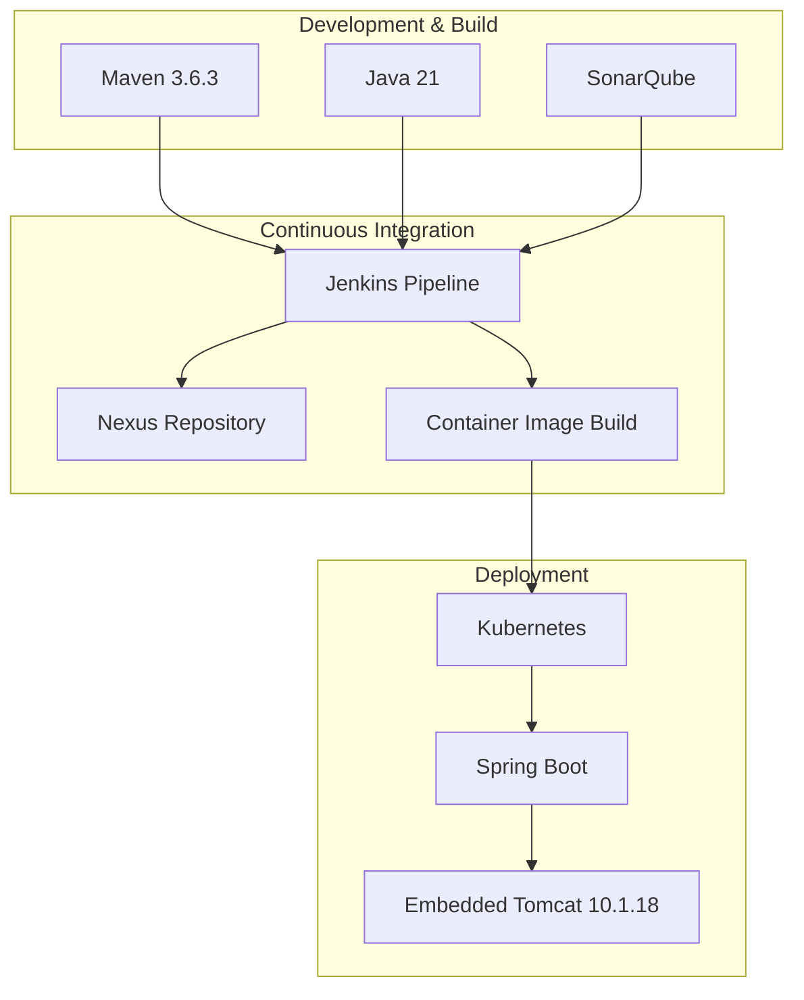

The updated deployment infrastructure emphasizes a modern, container-first approach with the following key characteristics:

- **Simplified Deployment Model**

  - \<span style="background-color: yellow"\>Self-contained Spring Boot applications with embedded Tomcat\</span\>
  - \<span style="background-color: yellow"\>Reduced deployment complexity through auto-configuration\</span\>
  - \<span style="background-color: yellow"\>Native support for cloud platforms and container orchestration\</span\>

- **Enhanced Operational Capabilities**

  - \<span style="background-color: yellow"\>Built-in monitoring and management endpoints\</span\>
  - \<span style="background-color: yellow"\>Streamlined configuration management\</span\>
  - \<span style="background-color: yellow"\>Improved resource utilization through container orchestration\</span\>

- **Deployment Flexibility**

  - \<span style="background-color: yellow"\>Support for both traditional and cloud-native deployment patterns\</span\>
  - \<span style="background-color: yellow"\>Seamless integration with modern DevOps practices\</span\>
  - \<span style="background-color: yellow"\>Enhanced scalability through container orchestration platforms\</span\>

## 3.6 Technology Stack Architecture

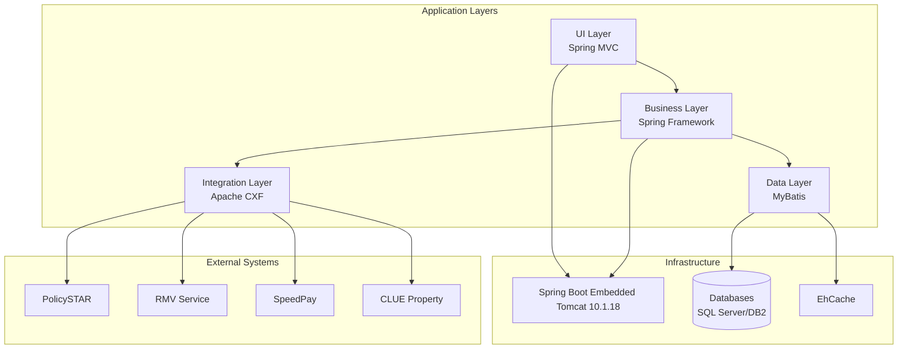

\<span style="background-color: yellow"\>The technology stack architecture leverages Spring Boot's auto-configuration and container-first design principles, providing several key advantages:\</span\>

\<span style="background-color: yellow"\>1. Simplified Deployment: The embedded Tomcat server eliminates the need for external application server configuration and management.\</span\>

\<span style="background-color: yellow"\>2. Enhanced Integration: Spring Boot's auto-configuration capabilities streamline the integration between different application layers and external systems.\</span\>

\<span style="background-color: yellow"\>3. Improved Scalability: The container-first design enables seamless horizontal scaling and efficient resource utilization in containerized environments.\</span\>

The architecture maintains clear separation between:

- UI Layer handling presentation logic through Spring MVC
- Business Layer implementing core business rules via Spring Framework
- Data Layer managing persistence through MyBatis
- Integration Layer facilitating external system communication via Apache CXF

\<span style="background-color: yellow"\>This modernized infrastructure model maintains all existing architectural boundaries while providing enhanced deployment flexibility and operational efficiency through Spring Boot's embedded container approach.\</span\>

# 4. PROCESS FLOWCHART

## 4.1 Core Business Workflows

### Policy Management Flow

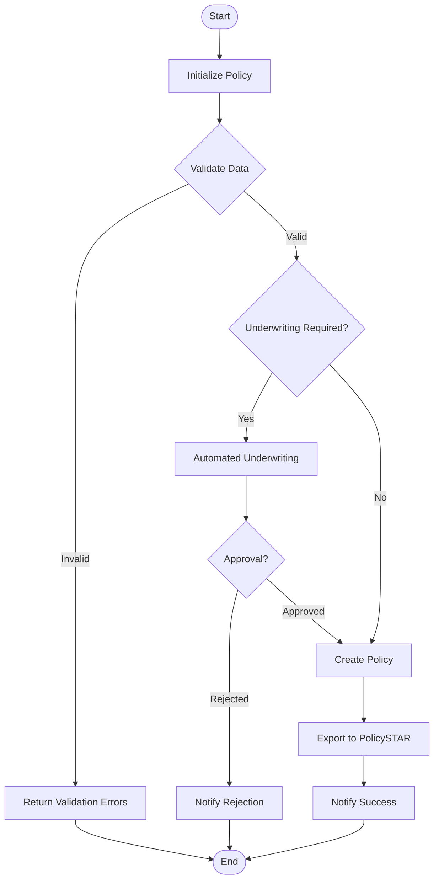

### Claims Processing Flow

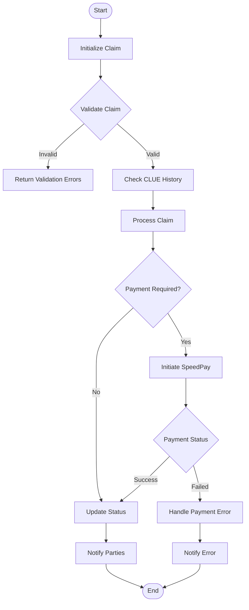

## 4.2 Integration Workflows

### System Integration Flow

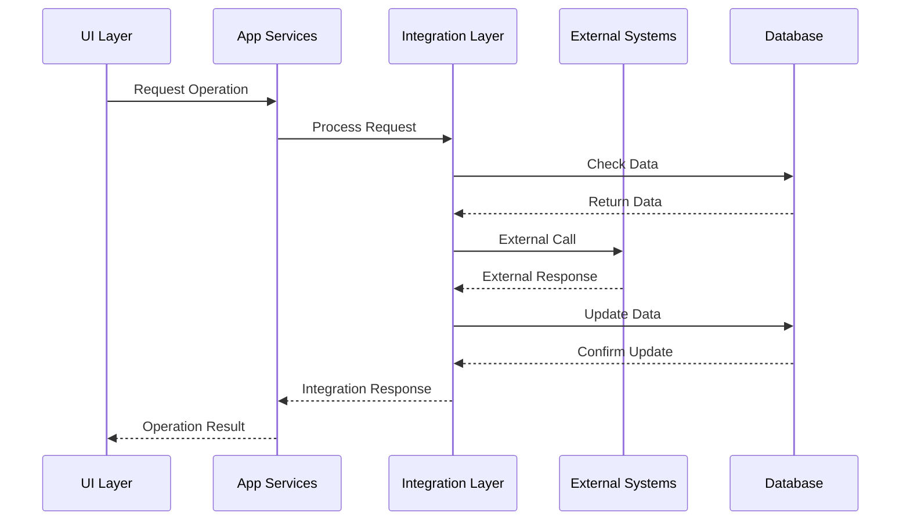

## 4.3 Error Handling Flows

### Error Management Process

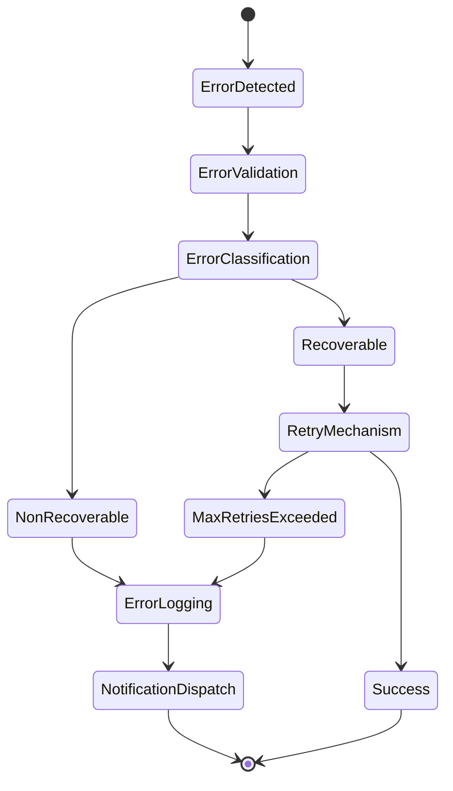

## 4.4 State Management

### Transaction State Flow

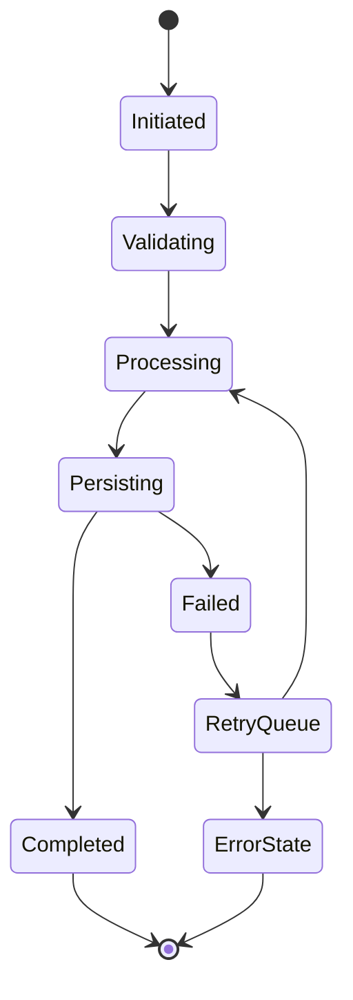

## 4.5 Validation Rules

### Business Rule Validation Flow

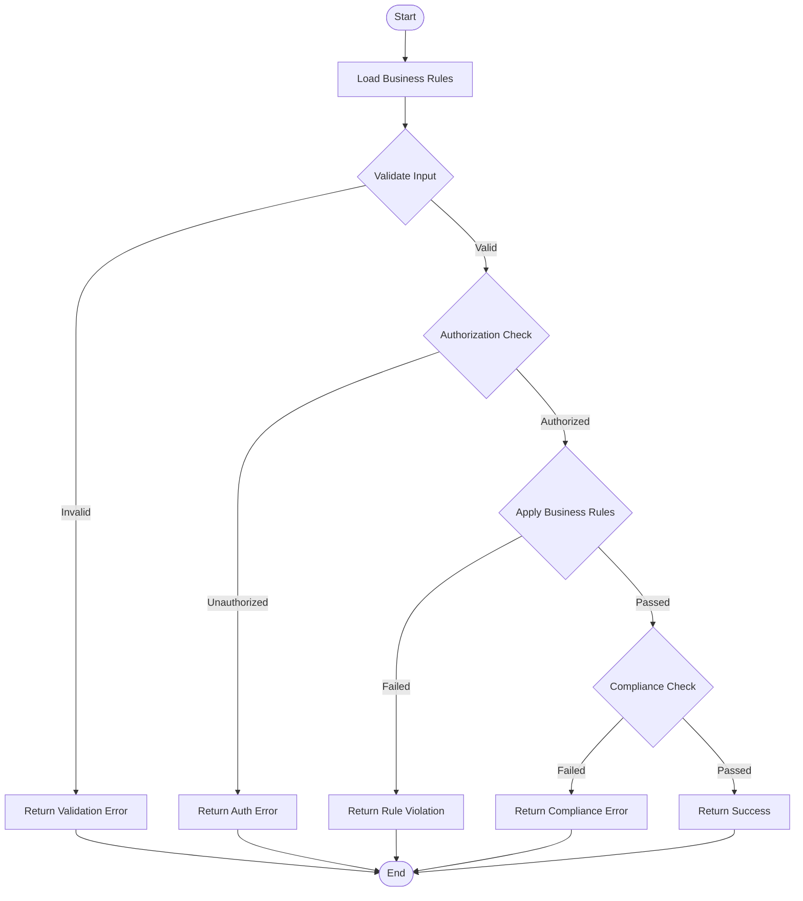

# 5. SYSTEM ARCHITECTURE

## 5.1 High-Level Architecture

### System Overview

The ai_umbrella system implements a multi-layered, service-oriented architecture \<span style="background-color: yellow"\>built on Spring Boot 3.2.x (built upon Spring Framework 6.1.x) and Java 21 LTS\</span\>. \<span style="background-color: yellow"\>The system has undergone a comprehensive modernization, including migration from javax.\* to jakarta.\* packages to ensure alignment with current Jakarta EE specifications\</span\>.

The system is divided into two major components:

1. Backend Services (umbrella-services)

   - Provides core business logic and data access capabilities
   - Implements service-oriented architecture with RESTful APIs
   - Handles integration with external systems
   - \<span style="background-color: yellow"\>Leverages Spring Boot's auto-configuration capabilities for streamlined deployment\</span\>
   - \<span style="background-color: yellow"\>Utilizes Virtual Threads for enhanced concurrent processing\</span\>

2. UI Application (umbrella-ui)

   - Delivers the presentation layer and user interface
   - Consumes backend services via REST
   - Manages UI-specific configurations
   - \<span style="background-color: yellow"\>Benefits from improved resource utilization through modern infrastructure\</span\>

The architecture emphasizes:

- Clear separation of concerns through modular design
- Service-oriented integration patterns
- Scalable and maintainable codebase
- Enterprise-grade security and performance
- \<span style="background-color: yellow"\>Container-first deployment model with embedded Tomcat 10.1.18\</span\>

### Core Components Table

| Component | Primary Responsibility | Key Dependencies | Critical Considerations |
| --- | --- | --- | --- |
| umbrella-config | Configuration management and runtime assembly | **Spring Boot 3.2.x** | Environment-specific configs |
| umbrella-integration | Data access and external system integration | **MyBatis, Apache CXF, Jakarta EE** | Transaction management |
| umbrella-model | Domain model implementation | **Java 21** | Immutable patterns |
| umbrella-appservices | Business logic orchestration | **Spring Boot, EhCache** | Service composition |
| umbrella-web | Web presentation layer | **Spring MVC, Embedded Tomcat 10.1.18** | RESTful API design |

### Data Flow Description

The system implements several key data flows:

1. Policy Management Flow

- UI initiates policy operations
- Backend services validate and process requests
- Integration layer handles external system communication
- Results propagate back through service layers
- \<span style="background-color: yellow"\>Enhanced performance through Virtual Thread processing\</span\>

2. Claims Processing Flow

- Claims data enters through UI
- Services layer orchestrates processing
- Integration with CLUE Property and SpeedPay
- Status updates flow back to UI
- \<span style="background-color: yellow"\>Improved concurrent processing capabilities\</span\>

3. Document Management Flow

- Document upload through web layer
- Processing in service layer
- Storage in document services
- Metadata persistence in databases
- \<span style="background-color: yellow"\>Optimized resource utilization for large file handling\</span\>

### External Integration Points

| System | Integration Type | Data Exchange Pattern | Protocol/Format |
| --- | --- | --- | --- |
| PolicySTAR | Batch Export | **Asynchronous with Virtual Threads** | File Transfer |
| RMV | Real-time | Request/Response | SOAP/XML |
| SpeedPay | Real-time | Request/Response | REST/JSON |
| CLUE Property | Real-time | Request/Response | SOAP/XML |

## 5.2 Component Details

### Backend Services Components

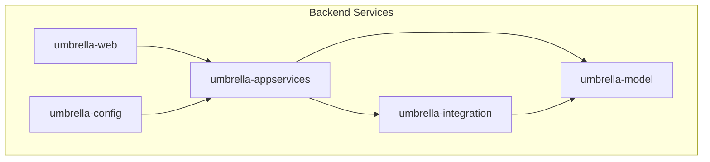

\<span style="background-color: yellow"\>The backend services leverage Spring Boot 3.2.x (based on Spring Framework 6.1.x) to provide a modern, auto-configured application stack. The system has completed migration from javax.\* to jakarta.\* packages, ensuring alignment with current Jakarta EE specifications. The embedded Tomcat 10.1.18 server enables streamlined deployment and enhanced containerization capabilities.\</span\>

Key Technologies:

- \<span style="background-color: yellow"\>Spring Boot 3.2.x (based on Spring Framework 6.1.x)\</span\>
- MyBatis 3.1.1 with Spring integration
- Apache CXF for service integration
- EhCache for caching
- Log4j2 with ECS layout

### UI Application Components

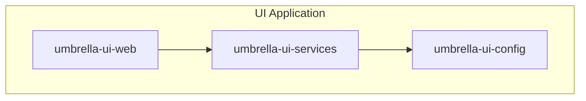

\<span style="background-color: yellow"\>The UI application components benefit from Spring Boot's auto-configuration capabilities, simplifying deployment through the embedded server architecture. The containerized deployment model enables efficient scaling and resource utilization, while maintaining clear separation of concerns between presentation and business logic layers.\</span\>

## 5.3 Technical Decisions

### Architecture Style Decisions

| Decision | Rationale | Trade-offs |
| --- | --- | --- |
| Layered Architecture | Clear separation of concerns | Additional complexity |
| Service-Oriented | Loose coupling, reusability | Network overhead |
| \<span style="background-color: yellow"\>Spring Boot 3.2.x\</span\> | \<span style="background-color: yellow"\>Auto-configuration, container-first design, simplified deployment\</span\> | \<span style="background-color: yellow"\>Learning curve for modern practices, migration effort from legacy systems\</span\> |

\<span style="background-color: yellow"\>The modernization strategy leverages Spring Boot's embedded Tomcat server, enhanced monitoring capabilities through Actuator endpoints, and native container orchestration compatibility. This approach provides significant advantages:\</span\>

\<span style="background-color: yellow"\>1. Simplified Operations

- Auto-configuration reduces deployment complexity
- Built-in monitoring and health check endpoints
- Container-first design enables seamless orchestration

2. Enhanced Scalability

- Native support for horizontal scaling
- Improved resource utilization
- Efficient container orchestration

3. Improved Maintainability

- Standardized configuration management
- Consistent deployment model
- Streamlined dependency management\</span\>

### Data Storage Solutions

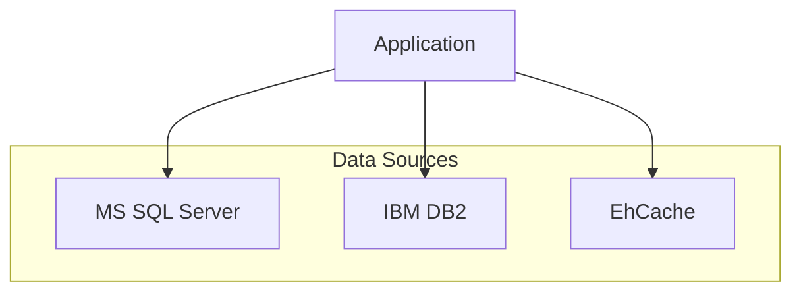

## 5.4 Cross-Cutting Concerns

### Monitoring and Observability

- Custom PerfMon implementation
- Log4j2 with ECS layout for structured logging
- Centralized error tracking

### Security Framework

- OWASP ESAPI 2.5.2.0 integration
- Authentication via JBoss security
- Authorization at service layer

### Error Handling Flow

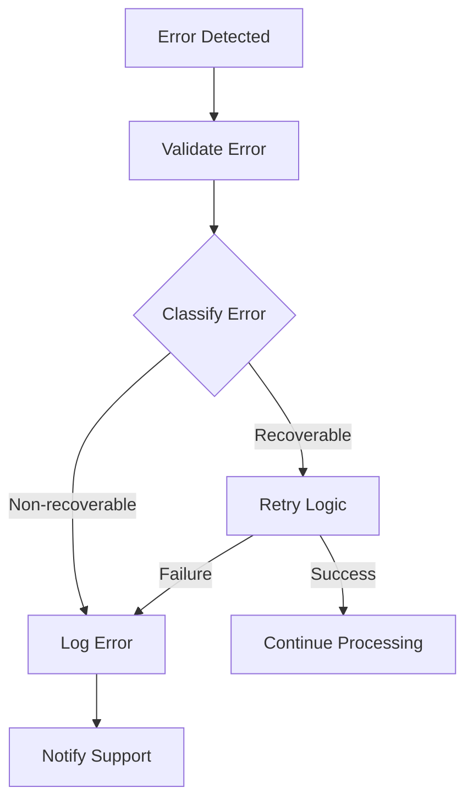

# 6. SYSTEM COMPONENTS DESIGN

# 6.1 CORE SERVICES ARCHITECTURE

### Service Components

#### Service Boundaries and Responsibilities

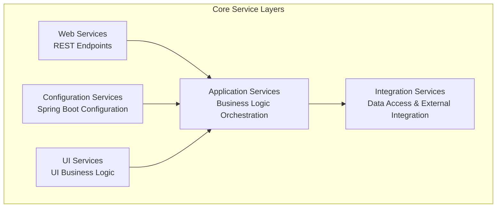

| Service Layer | Primary Responsibility | Key Components |
| --- | --- | --- |
| Application Services | Business logic orchestration | **Spring Boot auto-configuration, @Service components** |
| Integration Services | Data access and external systems | **Spring Data repositories, Jakarta Persistence** |
| Web Services | REST endpoints and presentation | **Spring WebMVC controllers, embedded Tomcat** |
| Configuration Services | Runtime configuration | **application.yml/properties, @Configuration classes** |

#### Inter-Service Communication

The system implements the following communication patterns:

- \<span style="background-color: yellow"\>Modern REST-based service communication using Spring WebClient with Virtual Thread support\</span\>
- \<span style="background-color: yellow"\>SOAP/XML services via Apache CXF with Jakarta XML Web Services\</span\>
- \<span style="background-color: yellow"\>JSON/XML message conversion leveraging Spring Boot's auto-configured message converters\</span\>
- \<span style="background-color: yellow"\>Asynchronous processing through Spring @Async annotation with Virtual Thread executor\</span\>

#### Service Discovery and Load Balancing

\<span style="background-color: yellow"\>Service discovery and load balancing are implemented through container orchestration platforms with the following capabilities:\</span\>

- \<span style="background-color: yellow"\>Dynamic service discovery via container platform service registry\</span\>
- \<span style="background-color: yellow"\>Native load balancing through container orchestration\</span\>
- \<span style="background-color: yellow"\>Health checks and readiness probes via Spring Boot Actuator endpoints\</span\>
- \<span style="background-color: yellow"\>Automatic scaling based on container platform metrics\</span\>

### Scalability Design

#### Scaling Approach

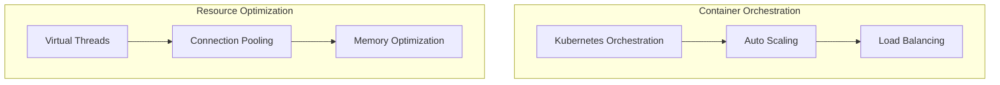

The system implements a modern, container-first scaling approach:

1. Horizontal Scaling

- \<span style="background-color: yellow"\>Kubernetes-based container orchestration enabling dynamic scaling\</span\>
- \<span style="background-color: yellow"\>Automated load balancing through service mesh capabilities\</span\>
- \<span style="background-color: yellow"\>Container-native service discovery and health monitoring\</span\>

2. Vertical Scaling

- \<span style="background-color: yellow"\>Java 21 Virtual Threads for efficient resource utilization\</span\>
- \<span style="background-color: yellow"\>Thread pool configuration leveraging virtual concurrency for improved performance\</span\>
- Memory optimization through caching

The scaling strategy provides:

- \<span style="background-color: yellow"\>Dynamic resource allocation based on actual load\</span\>
- \<span style="background-color: yellow"\>Automated container scaling through orchestration rules\</span\>
- \<span style="background-color: yellow"\>Improved performance under high payload conditions through Virtual Threads\</span\>
- \<span style="background-color: yellow"\>Enhanced resource utilization via container-based deployment\</span\>

### Resilience Patterns

#### Fault Tolerance Implementation

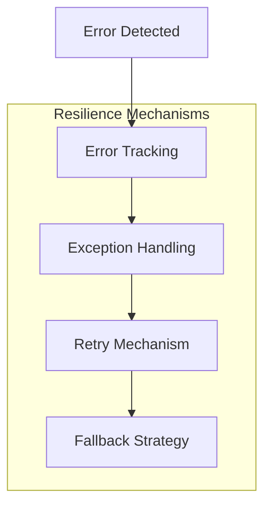

Key resilience features include:

1. Error Handling

- Comprehensive error tracking via errortracking.properties
- Custom exception handling through AppSvcException
- Service degradation policies
- Retry mechanisms for failed operations

2. Data Redundancy

- Multiple database support (SQL Server, DB2)
- Caching layers for data availability
- Session replication across cluster nodes

3. High Availability Configuration

- JBoss cluster configuration
- Multiple environment support
- Service endpoint fallbacks
- Database connection pooling

# 6.2 DATABASE DESIGN

### Schema Design

#### Entity Relationships

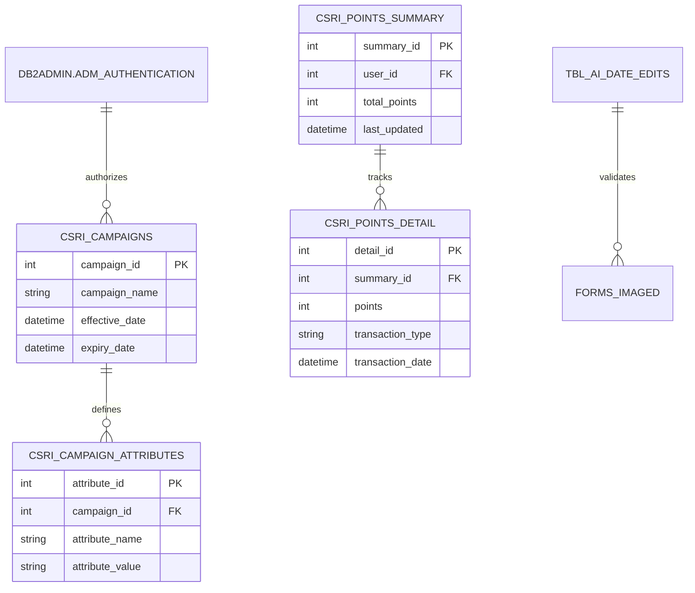

#### Data Models and Structures

Primary Tables:

- CSRI_CAMPAIGNS: Campaign configuration and lifecycle management
- CSRI_CAMPAIGN_ATTRIBUTES: Extensible campaign properties
- CSRI_POINTS_SUMMARY: Aggregated CSR points tracking
- CSRI_POINTS_DETAIL: Detailed points transaction history
- TBL_AI_DATE_EDITS: Security policy date validations
- DB2ADMIN.ADM_AUTHENTICATION: Authentication records
- FORMS_IMAGED: Document imaging status tracking

### Data Management

#### Migration Strategy (updated)

\<span style="background-color: yellow"\>The system leverages Flyway database migration tool to ensure reliable, version-controlled schema changes aligned with Spring Boot's auto-configuration capabilities\</span\>. Key aspects include:

- \<span style="background-color: yellow"\>Version-controlled schema changes using Flyway's migration scripts\</span\>

  * Sequenced SQL migration files
  * Repeatable migrations for views/procedures
  * Baseline support for existing schemas

- \<span style="background-color: yellow"\>Automated migration execution through Spring Boot integration\</span\>

  * Migration runs during application startup
  * Environment-specific configuration
  * Fail-fast validation of migration scripts

- \<span style="background-color: yellow"\>Robust data validation procedures\</span\>

  * Pre-migration data integrity checks
  * Post-migration verification steps
  * Schema version tracking

- \<span style="background-color: yellow"\>Reliable rollback capabilities\</span\>

  * Transactional migration execution
  * Undo scripts for each migration
  * Point-in-time recovery support

#### Data Retention and Archival (updated)

| Data Type | Retention Period | Archival Strategy | \<span style="background-color: yellow"\>Container Integration\</span\> |
| --- | --- | --- | --- |
| Campaigns | 7 years | Monthly archival | **Persistent volume claims** |
| Points History | 5 years | Quarterly archival | **Volume snapshots** |
| Authentication Logs | 2 years | Weekly archival | **Log aggregation** |
| Form Images | 10 years | Annual archival | **Object storage sync** |

\<span style="background-color: yellow"\>The data retention and archival procedures are integrated with the modern deployment environment through:\</span\>

- \<span style="background-color: yellow"\>Container-aware storage management\</span\>

  * Persistent volume lifecycle handling
  * Automated backup scheduling
  * Storage class optimization

- \<span style="background-color: yellow"\>Orchestration platform integration\</span\>

  * CronJob-based archival tasks
  * Resource quota management
  * Storage scaling policies

- \<span style="background-color: yellow"\>Cloud-native backup solutions\</span\>

  * Volume snapshot operations
  * Cross-region replication
  * Point-in-time recovery

### Performance Optimization

#### Query Optimization Patterns

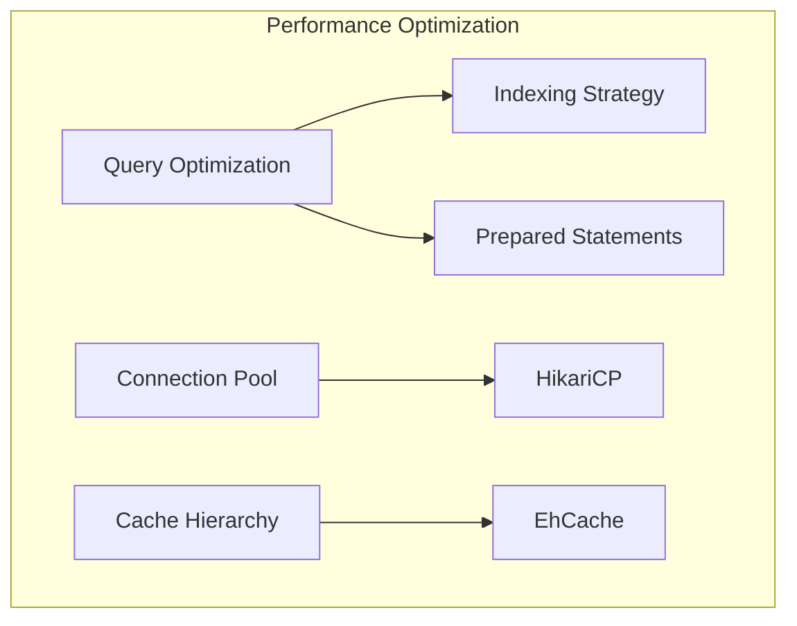

#### Caching Implementation

- EhCache integration via mybatis-ehcache 1.0.1
- Dedicated dropdown cache configuration
- Cache settings in mybatis-config.xml
- Selective cache disabling for direct DB access

#### Connection Management

- \<span style="background-color: yellow"\>HikariCP connection pooling, providing superior performance and integration with Spring Boot's auto-configuration capabilities\</span\>
- Multiple data source configurations:
  * dsCommon_WEB_Trans
  * dsCommon_WebCommon
  * dsCommon_CI_Common
  * dsCommon_ADR
  * dsCommon_WebPayment
  * Regional DB2 instances

\<span style="background-color: yellow"\>HikariCP offers several key advantages as the default connection pooling mechanism in Spring Boot 3.2.x:\</span\>

\<span style="background-color: yellow"\>- Optimized connection acquisition and release

- Minimal contention through efficient concurrency handling
- Reduced connection overhead through pool optimization
- Enhanced monitoring capabilities via metrics integration
- Simplified configuration through Spring Boot properties\</span\>

### Data Access Layer

#### ORM Configuration (updated)

- \<span style="background-color: yellow"\>MyBatis 3.1.1 with Spring Boot integration\</span\>
- Custom type handlers:
  * \<span style="background-color: yellow"\>CustomStringTypeHandler (updated with jakarta.\* packages)\</span\>
  * \<span style="background-color: yellow"\>JodaDateTimeTypeHandler (updated with jakarta.\* packages)\</span\>
- \<span style="background-color: yellow"\>Transaction management via Spring Boot's @Transactional\</span\>

#### DAO Implementation (updated)

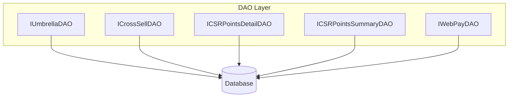

Key DAO Interfaces \<span style="background-color: yellow"\>(updated with jakarta.\* imports)\</span\>:

- IUmbrellaDAO: Core policy management
- ICrossSellDAO: Cross-selling operations
- IUserDAO: User management
- IErrorTrackingDAO: Error logging
- IADRDAO: Address data access
- IESignatureDAO: E-signature operations
- IEmailDAO: Email functionality
- IWebPayDAO: Payment processing
- ICSRPointsDetailDAO/ICSRPointsSummaryDAO: CSR rewards

# 6.3 INTEGRATION ARCHITECTURE

### API Design

#### Protocol Specifications

| Service Type | Protocol | Endpoint Pattern |
| --- | --- | --- |
| SOAP/XML | SOAP 1.1 | policynetest.prcins.net/*/services/* |
| REST/JSON | REST | apimstest.prcins.net/*/umbrellacore/* |
| Web Services | SOAP/XML | imageright.webservice/\*.asmx |

```mermaid
graph TB
    subgraph "API Architecture"
        REST[REST APIs]
        SOAP[SOAP Services] 
        WS[Web Services]
        
        REST --> JSON[JSON Processing]
        SOAP --> XML[XML Processing]
        WS --> WSDL[WSDL Contracts]
    end
```

#### Authentication & Authorization

- \<span style="background-color: yellow"\>Spring Security based integration leveraging Spring Boot auto-configuration and embedded Tomcat\</span\>
- Token-based authentication via /token/generate endpoint \<span style="background-color: yellow"\>utilizing the modern Spring Security framework\</span\>
- ESAPI 2.5.2.0 security controls
- Environment-specific security configurations
- \<span style="background-color: yellow"\>Security components migrated from javax.\* to jakarta.\* packages\</span\>

```mermaid
sequenceDiagram
    participant Client
    participant API
    participant Security
    participant Service

    Client->>API: Request with Token
    API->>Security: Validate Token
    Security->>Service: Authorize Request
    Service-->>API: Process Request
    API-->>Client: Response
```

### Message Processing

#### Event Processing Patterns

```mermaid
sequenceDiagram
    participant Client
    participant API
    participant Handler
    participant Queue
    participant External
    
    Client->>API: Request
    API->>Handler: Process
    Handler->>Queue: Queue Message
    Queue->>External: Process Message
    External-->>Queue: Response
    Queue-->>Handler: Result
    Handler-->>API: Response
    API-->>Client: Result
```

#### Error Handling Strategy

- CustomResponseErrorHandler for HTTP errors
- MiddlewareErrorTranslator for service errors
- Centralized error mapping configuration
- Service-specific error properties

### External Systems Integration

#### Third-Party Integration Points

```mermaid
graph TB
    subgraph "External Integrations"
        PS[PolicySTAR Export]
        RMV[Registry of Motor Vehicles]
        SP[SpeedPay Services]
        IR[ImageRight Services]
        CP[CLUE Property]
    end
    
    API[Integration Layer] --> PS
    API --> RMV
    API --> SP
    API --> IR
    API --> CP
```

#### Service Contracts

| Service | Contract Type | Implementation |
| --- | --- | --- |
| PolicySTAR | WSDL | TFGCPLCommercialXMLServicePortType |
| Billing | WSDL | BillingWebServiceServiceLocator |
| ImageRight | WSDL | IRWebService40 |
| eService | REST | AccountAPI |

### Configuration Management

#### Environment Configuration (updated)

\<span style="background-color: yellow"\>The system leverages Spring Boot's auto-configuration capabilities for managing environment-specific settings through the following mechanisms:\</span\>

- \<span style="background-color: yellow"\>Application configuration files:\</span\>

  * application.yml (default configuration)
  * application-{profile}.yml (environment-specific overrides)
  * bootstrap.yml (configuration server settings)

- \<span style="background-color: yellow"\>Environment variables for containerized deployments:\</span\>

  * SPRING_PROFILES_ACTIVE
  * SPRING_CONFIG_LOCATION
  * SPRING_CLOUD_CONFIG_URI
  * Application-specific variables

- \<span style="background-color: yellow"\>Configuration server integration:\</span\>

  * Centralized configuration management
  * Version-controlled properties
  * Dynamic configuration updates
  * Environment-specific settings

#### Integration Settings (updated)

```mermaid
graph TB
    subgraph "Configuration Hierarchy"
        ENV[Spring Boot Config]
        SVC[Service Config]
        SEC[Security Config]
        
        ENV --> SVC
        ENV --> SEC
        SVC --> EP[Endpoints]
        SEC --> AUTH[Authentication]
    end
```

\<span style="background-color: yellow"\>The integration settings leverage Spring Boot's native configuration capabilities to manage:\</span\>

- \<span style="background-color: yellow"\>Service endpoints and connection details\</span\>

  * REST/SOAP service URLs
  * Connection timeouts
  * Retry configurations
  * Circuit breaker settings

- \<span style="background-color: yellow"\>Security configurations\</span\>

  * Authentication providers
  * Authorization rules
  * Token configurations
  * SSL/TLS settings

- \<span style="background-color: yellow"\>Integration patterns\</span\>

  * Message formats
  * Protocol settings
  * Error handling
  * Logging configurations

\<span style="background-color: yellow"\>This modern configuration approach provides several advantages:\</span\>

1. \<span style="background-color: yellow"\>Simplified deployment through auto-configuration\</span\>
2. \<span style="background-color: yellow"\>Enhanced container compatibility\</span\>
3. \<span style="background-color: yellow"\>Centralized configuration management\</span\>
4. \<span style="background-color: yellow"\>Dynamic property updates\</span\>

### Message Queue Architecture

#### Queue Configuration

- Service-specific queues for:
  * Policy Quote Generation
  * Forms Enterprise
  * CLUE Property Claims
  * RMV Services
  * Billing Services
  * SpeedPay Services

#### Processing Flows

```mermaid
graph LR
    subgraph "Message Processing"
        IN[Input] --> VAL[Validation]
        VAL --> PROC[Processing]
        PROC --> OUT[Output]
        
        PROC --> ERR[Error Handler]
        ERR --> RTY[Retry Queue]
        RTY --> PROC
    end
```

### Integration Monitoring

#### Metrics & Logging

\<span style="background-color: yellow"\>The system leverages Spring Boot Actuator endpoints for comprehensive integration monitoring, providing:\</span\>

- \<span style="background-color: yellow"\>Structured logging with Log4j2 ECS layout integrated with Spring Boot's auto-configuration\</span\>
- \<span style="background-color: yellow"\>Integration-specific error tracking via Actuator /metrics endpoint\</span\>
- \<span style="background-color: yellow"\>Performance monitoring through Actuator /prometheus endpoint\</span\>
- \<span style="background-color: yellow"\>Transaction tracing capabilities via Actuator /trace endpoint\</span\>

#### Health Checks

\<span style="background-color: yellow"\>Health monitoring is implemented through Spring Boot Actuator's /health endpoint, providing automated health checks for:\</span\>

| Integration Point | Check Type | Frequency | \<span style="background-color: yellow"\>Health Indicator\</span\> |
| --- | --- | --- | --- |
| PolicySTAR | Connectivity | 5 min | **Custom HealthIndicator** |
| RMV Services | Availability | 10 min | **Custom HealthIndicator** |
| SpeedPay | Transaction | 15 min | **Custom HealthIndicator** |
| ImageRight | Service Status | 5 min | **Custom HealthIndicator** |

\<span style="background-color: yellow"\>The health check implementation provides:

1. Auto-configured health indicators for each integration point
2. Customizable health check logic through HealthIndicator interfaces
3. Aggregated health status via the /health endpoint
4. Environment-specific health check configurations\</span\>

\<span style="background-color: yellow"\>Additional monitoring capabilities through Spring Boot Actuator include:

- /metrics endpoint for detailed performance metrics
- /env endpoint for environment configuration verification
- /loggers endpoint for runtime log level management
- /info endpoint for application information\</span\>

# 6.4 SECURITY ARCHITECTURE

### Authentication Framework

#### Identity Management

```mermaid
sequenceDiagram
    participant User
    participant AIUIFilter
    participant SpringSecurityFilter
    participant AuthenticationManager
    participant Session

    User->>AIUIFilter: Access Request
    AIUIFilter->>SpringSecurityFilter: Validate Credentials
    SpringSecurityFilter->>AuthenticationManager: Authenticate
    AuthenticationManager-->>SpringSecurityFilter: Auth Result
    SpringSecurityFilter-->>AIUIFilter: Auth Status
    AIUIFilter->>Session: Create Session
    Session-->>User: Session Token
```

| Authentication Setting | Value | Description |
| --- | --- | --- |
| Maximum Login Attempts | 3 | Prevents brute force attacks |
| Password History | 13 | Previous passwords stored |
| Remember Token Duration | 14 days | Persistent auth token lifetime |
| Idle Timeout | 20 minutes | Session inactivity limit |
| Absolute Timeout | 120 minutes | Maximum session duration |

\<span style="background-color: yellow"\>The identity management flow leverages Spring Security's auto-configured authentication mechanisms, with the following key components migrated from javax.\* to jakarta.\* packages:\</span\>

- \<span style="background-color: yellow"\>SpringSecurityFilter chain replacing FileBasedAuthenticator\</span\>
- \<span style="background-color: yellow"\>AuthenticationManager replacing ESAPI authentication\</span\>
- \<span style="background-color: yellow"\>Built-in token management capabilities\</span\>

\<span style="background-color: yellow"\>Recommendation: The system should fully adopt Spring Security's built-in authentication mechanisms to:

- Reduce maintenance overhead through standardized security patterns
- Leverage auto-configured security features
- Simplify token management and filter chain configuration
- Enable seamless integration with modern authentication protocols\</span\>

#### Multi-Factor Authentication

The FiservSecurityService implements context-aware MFA supporting:

- Default authentication context
- New business context requiring additional verification
- Endorsement context with elevated security requirements

\<span style="background-color: yellow"\>Note: The FiservSecurityService and its dependencies have been verified for Jakarta EE compatibility while maintaining the existing context-aware MFA capabilities. The service continues to support multiple authentication contexts through Spring Security's extensible authentication framework.\</span\>

### Authorization System

#### Role-Based Access Control (updated)

```mermaid
graph TB
    subgraph "Authorization Flow"
        Login[LoginUIController]
        Role[SpringSecurityRoleManager]
        Access[SpringMethodSecurityController] 
        Policy[SpringSecurityPolicyEnforcer]
        
        Login --> Role
        Role --> Access
        Access --> Policy
    end
```

\<span style="background-color: yellow"\>The authorization system has been modernized to leverage Spring Security's method-level and annotation-driven security features available in Spring Boot 3.2.x. The core components have been migrated from javax.\* to jakarta.\* packages while maintaining the existing permission levels.\</span\>

#### Permission Management Matrix (updated)

| Resource Type | Admin | Manager | User | Guest |
| --- | --- | --- | --- | --- |
| Policy Data | **Full** | **Read/Write** | **Read** | **None** |
| Claims Data | **Full** | **Read/Write** | **Read** | **None** |
| User Management | **Full** | **Read** | **None** | **None** |
| Reports | **Full** | **Full** | **Read** | **None** |

\<span style="background-color: yellow"\>The permission management system now utilizes Spring Security's @PreAuthorize and @PostAuthorize annotations for method-level security, while maintaining the existing role hierarchy and access levels. This provides:

1. Declarative security through annotations
2. Runtime evaluation of security expressions
3. Integration with Spring AOP for method interception
4. Support for SpEL-based authorization rules\</span\>

\<span style="background-color: yellow"\>The modernized authorization components ensure consistent functionality in containerized environments through:

1. Auto-configured security filters
2. Container-aware session management
3. Distributed security context propagation
4. Stateless authorization for scalability\</span\>

### Data Protection

#### Encryption Standards

- AES Encryption Configuration:
  * Default Mode: AES/CBC/PKCS5Padding
  * Key Length: 128-bit
  * IV Generation: Configurable (Random/Fixed)
  * Support for GCM/CCM modes

#### Input Validation Rules

```mermaid
graph TB
    subgraph "Validation Framework"
        Input[Input Data]
        Pattern[Pattern Validation]
        Type[Type Validation]
        Format[Format Validation]
        
        Input --> Pattern
        Pattern --> Type
        Type --> Format
    end
```

| Data Type | Validation Pattern | Example |
| --- | --- | --- |
| Email | ^\[A-Za-z0-9.\_%+-\]+@\[A-Za-z0-9.-\]+.\[A-Za-z\]{2,}$ | user@domain.com |
| SSN | ^\\d{3}-\\d{2}-\\d{4}$ | 123-45-6789 |
| Credit Card | ^\[0-9\]{16}$ | 1234567890123456 |
| Phone | ^\\d{3}-\\d{3}-\\d{4}$ | 123-456-7890 |

### Security Zones

```mermaid
graph TB
    subgraph "DMZ"
        LB[Load Balancer]
        WAF[Web Application Firewall]
    end

    subgraph "Application Zone"
        WEB[Web Servers]
        APP[Application Servers]
    end

    subgraph "Data Zone"
        DB[Databases]
        CACHE[Cache Servers]
    end

    Internet --> LB
    LB --> WEB
    WEB --> DB
```

### Audit Logging

#### Logging Configuration

- Log4j2 with ECS layout for structured logging
- MDCUtil for diagnostic context tracking
- PerformanceLogger for security metrics
- Comprehensive session activity logging

#### Security Event Matrix

| Event Type | Severity | Retention | Alert |
| --- | --- | --- | --- |
| Auth Failure | High | 90 days | Yes |
| Access Violation | High | 90 days | Yes |
| Data Export | Medium | 30 days | No |
| Config Change | High | 365 days | Yes |

### CSRF Protection

The RequestInitializeInterceptor implements:

- Token-based CSRF validation
- State-changing operation protection
- Configurable path exclusions
- Secure token generation and validation

### HTTP Security Headers

```mermaid
graph TB
    subgraph "Security Headers"
        CSP[Content-Security-Policy]
        HSTS[Strict-Transport-Security]
        XFO[X-Frame-Options]
        XXP[X-XSS-Protection]
        XCTO[X-Content-Type-Options]
    end
```

### File Upload Security

- Controlled upload directories
- Approved file extension whitelist
- Maximum file size limits
- Content type validation
- Malware scanning integration

### Intrusion Detection

- ESAPI intrusion detection system
- Configurable event thresholds
- Protection against:
  * Authentication attacks
  * Session hijacking
  * Input validation attacks
  * Access control violations

# 6.5 MONITORING AND OBSERVABILITY

### Logging Infrastructure

#### Logging Framework Configuration (updated)

\<span style="background-color: yellow"\>The system utilizes Log4j2 with ECS layout integrated with Spring Boot Actuator's logging capabilities\</span\>:

| Environment | Configuration | Appenders | \<span style="background-color: yellow"\>Actuator Integration\</span\> |
| --- | --- | --- | --- |
| Production | \<span style="background-color: yellow"\>application-prod.yml\</span\> | Console, RollingFile, RollingJsonFile | **Metrics, Loggers endpoints** |
| QA | \<span style="background-color: yellow"\>application-qa.yml\</span\> | Console, RollingFile | **Metrics endpoint** |

Key logging features include:

- Log rotation and retention policies
- \<span style="background-color: yellow"\>Environment-specific configurations through Spring Boot's application.yml\</span\>
- Plain text and JSON formatted outputs
- \<span style="background-color: yellow"\>MDC context enrichment updated for jakarta.\* package compatibility\</span\>
- \<span style="background-color: yellow"\>Integration with Spring Boot Actuator's /actuator/loggers endpoint\</span\>

#### Performance Logging (updated)

```mermaid
graph TB
subgraph "Performance Monitoring"
    PM[PerfLogger] --> LM[LogMonitor]
    LM --> LC[LogConsumer]
    PM --> PU[PerfUtil]
    PU --> MT[Metrics Tracking]
    
    subgraph "Spring Boot Actuator"
        ME[/actuator/metrics/]
        HE[/actuator/health/]
        LE[/actuator/loggers/]
    end
    
    MT --> ME
    LM --> HE
    PM --> LE
end
```

Performance monitoring components:

- LogMonitor for service performance tracking
- PerfUtil for performance utilities
- LogConsumer for logging behavior
- PerfLogger for performance metrics
- \<span style="background-color: yellow"\>Integration with Spring Boot Actuator metrics endpoints\</span\>
- \<span style="background-color: yellow"\>Scheduled performance initialization tasks leveraging Spring's @Scheduled\</span\>

\<span style="background-color: yellow"\>The modernized logging infrastructure provides several key advantages:

1. Simplified Configuration

- Externalized settings in application.yml/properties
- Environment-specific configurations
- Auto-configured logging levels
- Dynamic logger management

2. Enhanced Monitoring

- Integration with Actuator metrics
- Centralized logging configuration
- Runtime log level management
- Performance metric collection

3. Container-Friendly Design

- Standardized log output formats
- Configurable log aggregation
- Container-aware logging
- Cloud-native compatibility\</span\>

### Health Check System

#### Health Check Architecture (updated)

```mermaid
graph TB
    subgraph "Health Checks"
        AH[Spring Boot Actuator Health]
        VS[Version Status]
        ES[Environment Status]
        SS[System Status]
        LB[Load Balancer Check]
        
        AH --> VS
        AH --> ES
        AH --> SS
        AH --> LB
    end
```

\<span style="background-color: yellow"\>The health check system has been modernized to leverage Spring Boot Actuator's built-in health check capabilities, replacing the custom HealthCheckController implementation. The system now exposes health information through the standardized '/actuator/health' endpoint\</span\>.

Health check endpoints:

- \<span style="background-color: yellow"\>'/actuator/health' for system health status\</span\>
- \<span style="background-color: yellow"\>'/actuator/health/version' for version information\</span\>
- \<span style="background-color: yellow"\>'/actuator/health/environment' for environment status\</span\>
- \<span style="background-color: yellow"\>'/actuator/health/liveness' for load balancer integration\</span\>

\<span style="background-color: yellow"\>The health check system provides the following key capabilities through Spring Boot Actuator:

1. Automated Health Indicators

- Database connectivity checks
- Disk space monitoring
- Application status verification
- Custom health indicator support

2. Configurable Health Details

- Customizable health check groups
- Environment-specific health mappings
- Detailed health information exposure
- Security-aware health status

3. Load Balancer Integration

- Kubernetes liveness/readiness probes
- Container orchestration compatibility
- Automated instance health tracking
- Zero-downtime deployment support\</span\>

\<span style="background-color: yellow"\>Health check responses follow the standard Spring Boot Actuator format:

```json
{
  "status": "UP",
  "components": {
    "version": {
      "status": "UP",
      "details": {
        "version": "1.0.0"
      }
    },
    "environment": {
      "status": "UP",
      "details": {
        "environment": "production"
      }
    }
  }
}
```</span>

### Error Tracking

#### Error Management Configuration
The error tracking system supports:

| Error Type | Email Alert | Template |
|------------|-------------|-----------|
| RETRIEVE_POLICY | Yes | Policy retrieval failure |
| RATING | Yes | Rating engine errors |
| POLICY_GENERATOR | Yes | Policy generation issues |
| TRANSFORM_POLICY_TO_XML | Yes | XML transformation errors |

### Request Tracing

#### Request Context Management
```mermaid
sequenceDiagram
    participant Client
    participant Filter as UmbrellaMDCFilter
    participant Service
    participant Logger
    participant Actuator as Spring Boot Actuator
    
    Client->>Filter: HTTP Request
    Filter->>Filter: Generate Request ID
    Filter->>Service: Enriched Request
    Service->>Logger: Log with Context
    Service->>Actuator: Trace Request
    Logger-->>Service: Confirmation
    Actuator-->>Service: Trace ID
    Service-->>Filter: Response
    Filter-->>Client: HTTP Response
```

Key tracing features:

- \<span style="background-color: yellow"\>HTTP request interception using jakarta.servlet.Filter\</span\>
- \<span style="background-color: yellow"\>MDC context management with Spring Boot's tracing support\</span\>
- Performance metrics capture
- \<span style="background-color: yellow"\>Request ID generation integrated with Spring Boot Actuator tracing\</span\>

\<span style="background-color: yellow"\>The request tracing implementation leverages Spring Boot Actuator's tracing capabilities through:

1. Trace Context Management

- Automatic trace ID generation
- Distributed tracing support
- Context propagation across services
- Integration with logging framework

2. Actuator Endpoints

- /actuator/httptrace for request tracing
- /actuator/metrics for performance metrics
- /actuator/health for component status
- Custom trace repositories support\</span\>

\<span style="background-color: yellow"\>The UmbrellaMDCFilter has been updated to:

- Use jakarta.servlet.Filter instead of javax.servlet.Filter
- Integrate with Spring Boot's tracing infrastructure
- Leverage auto-configured trace repositories
- Support modern distributed tracing patterns\</span\>

Configuration properties:

```yaml
management:
  endpoints:
    web:
      exposure:
        include: health,metrics,httptrace
  trace:
    http:
      enabled: true
      include: request-headers,response-headers,cookies,errors
```

\<span style="background-color: yellow"\>This modern tracing approach provides:

- Enhanced visibility into request flows
- Improved debugging capabilities
- Standardized tracing patterns
- Container-aware context propagation\</span\>

### Integration Monitoring

#### REST Template Monitoring

\<span style="background-color: yellow"\>The LogRestTemplateInterceptor has been updated to leverage Spring Boot Actuator's metrics endpoints and jakarta.\* packages, providing:\</span\>

- \<span style="background-color: yellow"\>HTTP transaction metrics exposed via /actuator/metrics/http.client.requests\</span\>
- \<span style="background-color: yellow"\>Request/response capture with jakarta.servlet compatibility\</span\>
- \<span style="background-color: yellow"\>Header and body logging integrated with Spring Boot's logging infrastructure\</span\>
- \<span style="background-color: yellow"\>UTF-8 string conversion using jakarta.xml.bind\</span\>

\<span style="background-color: yellow"\>The monitoring implementation now benefits from Spring Boot's auto-configured observability features including:

1. Metrics Collection

- Request timing metrics
- Response size tracking
- Status code distribution
- Circuit breaker states

2. Health Monitoring

- Connection pool status
- Endpoint availability
- SSL certificate validation
- Timeout tracking\</span\>

#### Aspect-Based Monitoring (updated)

```mermaid
graph TB
    subgraph "Aspect Monitoring"
        AA[AroundAspect]
        MT[Method Timing]
        DC[Diagnostic Context]
        AL[Async Logging]
        ST[Session Tracking]
        PM[Prometheus Metrics]
        
        AA --> MT
        AA --> DC
        AA --> AL
        AA --> ST
        AA --> PM
    end
```

\<span style="background-color: yellow"\>The aspect-based monitoring has been enhanced to integrate with Spring Boot's metrics infrastructure:

1. Method-Level Metrics

- Timing metrics via @Timed annotation
- Method invocation counts
- Exception tracking
- Custom metric tags

2. Diagnostic Context

- MDC integration with Spring Boot logging
- Distributed tracing support
- Context propagation in async operations
- Container-aware context management

3. Prometheus Integration

- Auto-configured metrics endpoints
- Custom metric registration
- Label-based filtering
- Aggregation rules\</span\>

\<span style="background-color: yellow"\>Key monitoring endpoints now available:

- /actuator/metrics - Core metrics endpoint
- /actuator/prometheus - Prometheus-formatted metrics
- /actuator/health - Component health status
- /actuator/loggers - Logging configuration\</span\>

### XML Transaction Logging

The XMLLogger implements:

- Policy context logging
- Standardized patterns
- MDC context management
- Debug message enrichment

### Alert Management

#### Alert Configuration

```mermaid
graph TB
    subgraph "Alert Flow"
        ED[Error Detection]
        EC[Error Classification]
        TM[Template Matching]
        ER[Email Routing]
        
        ED --> EC
        EC --> TM
        TM --> ER
    end
```

Alert delivery features:

- Email-based alerting
- Template-driven notifications
- Environment-specific routing
- Configurable CC addresses

# 6.6 TESTING STRATEGY

### Testing Framework Stack

The core testing infrastructure consists of:

| Framework | Version | Purpose |
| --- | --- | --- |
| \<span style="background-color: yellow"\>JUnit Jupiter\</span\> | \<span style="background-color: yellow"\>5.10.1\</span\> | \<span style="background-color: yellow"\>Modern unit testing framework with enhanced features\</span\> |
| Mockito | 5.8.0 | Mocking framework |
| \<span style="background-color: yellow"\>Mockito-inline\</span\> | \<span style="background-color: yellow"\>5.8.0\</span\> | \<span style="background-color: yellow"\>Advanced mocking capabilities for final and static methods\</span\> |
| MeanBean | 3.0.0 | Bean testing |
| Jacoco | 0.8.11 | Code coverage |
| \<span style="background-color: yellow"\>Spring Boot Test\</span\> | \<span style="background-color: yellow"\>3.2.1\</span\> | \<span style="background-color: yellow"\>Integration testing with auto-configuration support\</span\> |

\<span style="background-color: yellow"\>The testing framework stack has been modernized to align with Java 21 and Spring Boot 3.2.x requirements:\</span\>

\<span style="background-color: yellow"\>1. JUnit Jupiter (JUnit 5) provides:

- Support for Java 21 features
- Enhanced test lifecycle management
- Improved parameterized testing
- Parallel test execution capabilities\</span\>

\<span style="background-color: yellow"\>2. Mockito-inline replaces PowerMock to provide:

- Native support for mocking final classes
- Static method mocking capabilities
- Better integration with JUnit Jupiter
- Improved performance and reliability\</span\>

\<span style="background-color: yellow"\>3. Spring Boot Test offers:

- Auto-configured test context
- Simplified integration testing
- Built-in test utilities
- Container-aware test execution\</span\>

\<span style="background-color: yellow"\>Key testing capabilities include:

1. Unit Testing

- JUnit Jupiter test execution
- Mockito mocking framework
- Parameterized testing support
- Assertion libraries

2. Integration Testing

- Spring Boot Test context
- Test configuration support
- Transaction management
- Test web environment

3. Code Coverage

- Jacoco instrumentation
- Coverage reporting
- Quality gates
- Branch coverage analysis\</span\>

### Test Organization Structure

```mermaid
graph TB
    subgraph "Test Organization"
        UT[Unit Tests]
        IT[Integration Tests]
        RT[Resource Tests]
        
        UT --> SRC[src/test/java]
        IT --> SRC
        RT --> RES[src/test/resources]
    end
```

Key test locations:

- Unit tests: src/test/java
- Test resources: src/test/resources
- Test configurations:
  * AppSvc-Beans-spring-test.xml
  * test-service-context.xml
  * TestCase-DataSourceCtx-spring.xml

### Test Categories

#### Unit Testing

Unit tests cover:

- \<span style="background-color: yellow"\>Bean validation using JUnit Jupiter annotations (ExposureTest, CoverageTest)\</span\>
- \<span style="background-color: yellow"\>Service layer with modern testing patterns (ViolationsServiceTest, ClueAccidentsServiceTest)\</span\>
- \<span style="background-color: yellow"\>Client integration leveraging Spring Boot Test (ADRClientTest, LoginClientTest)\</span\>
- \<span style="background-color: yellow"\>Utility classes with JUnit Jupiter (ProducerUtilTest)\</span\>

#### Integration Testing

Integration tests validate:

- \<span style="background-color: yellow"\>REST service integration using @SpringBootTest\</span\>
- \<span style="background-color: yellow"\>Database operations via MyBatis with Spring Boot's auto-configuration\</span\>
- External service mocking:
  * PolicySTAR Export
  * RMV Services
  * SpeedPay
  * CLUE Property

### Test Data Management

```mermaid
graph TB
    subgraph "Test Data Flow"
        TD[Test Data]
        TF[Test Fixtures]
        XML[XML Files]
        PROP[Properties]
        MOCK[Mock Data]
        
        TD --> TF
        TD --> XML
        TD --> PROP
        TD --> MOCK
    end
```

Test data sources include:

- UmbrellaTestData class for fixtures
- XML test files for policy data
- Properties files for configuration
- Mock response data for external services

### Test Environment Configuration

Environment-specific test setup:

- Profile: agency6
- Region: co1
- Environment mode: test
- Test data location: /opt/shared/jboss/${profile}/umbrella/

### Test Automation

```mermaid
graph TB
    subgraph "CI/CD Test Flow"
        Build[Build]
        Unit[Unit Tests]
        Int[Integration Tests]
        Cov[Coverage]
        Report[Reports]
        
        Build --> Unit
        Unit --> Int
        Int --> Cov
        Cov --> Report
    end
```

CI/CD integration features:

- Jenkins pipeline configuration
- Conditional test execution
- SonarQube quality gates
- Jacoco coverage reporting

### Quality Metrics

| Metric | Target | Enforcement |
| --- | --- | --- |
| Unit Test Coverage | 80% | Quality Gate |
| Integration Test Coverage | 60% | Quality Gate |
| Test Success Rate | 100% | Pipeline Block |
| Code Quality | A | SonarQube |

### Test Infrastructure

\<span style="background-color: yellow"\>The test infrastructure has been modernized to leverage Spring Boot's auto-configuration capabilities and container-friendly test execution. Key updates include:\</span\>

### Database Configurations

- \<span style="background-color: yellow"\>Test database configuration via application-test.yml replacing TestCase-DataSourceCtx-spring.xml\</span\>
- \<span style="background-color: yellow"\>Support for SQL Server and DB2 through Spring Boot's auto-configured data sources\</span\>
- \<span style="background-color: yellow"\>Test data isolation through @DirtiesContext and @Transactional annotations\</span\>

### External Service Mocks

\<span style="background-color: yellow"\>Service mocks have been updated to use Spring Boot Test's MockBean support:\</span\>

- PolicySTAR Export

```java
@MockBean
private PolicyStarExportService policyStarExportService;
```

- RMV Services

```java
@MockBean
private RMVIntegrationService rmvService;
```

- SpeedPay

```java
@MockBean
private SpeedPayService speedPayService;
```

- CLUE Property

```java
@MockBean
private CLUEPropertyService cluePropertyService;
```

- Billing Services

```java
@MockBean
private BillingIntegrationService billingService;
```

\<span style="background-color: yellow"\>The modernized test infrastructure provides several key advantages:

1. Simplified Configuration

- Auto-configured test context through Spring Boot
- Profile-based test configurations
- Container-friendly test execution
- Standardized mock injection

2. Enhanced Isolation

- Transaction management per test
- Automated context cleanup
- Independent test execution
- Mock verification support

3. Improved Maintainability

- Declarative test configuration
- Centralized mock definitions
- Consistent testing patterns
- Reduced boilerplate code\</span\>

\<span style="background-color: yellow"\>Example test configuration in application-test.yml:\</span\>

```yaml
spring:
  datasource:
    primary:
      url: jdbc:sqlserver://localhost:1433;databaseName=UMBRELLA_TEST
      username: ${TEST_DB_USER}
      password: ${TEST_DB_PASSWORD}
      driver-class-name: com.microsoft.sqlserver.jdbc.SQLServerDriver
    secondary:
      url: jdbc:db2://localhost:50000/UMBRELLA_TEST
      username: ${TEST_DB2_USER}
      password: ${TEST_DB2_PASSWORD}
      driver-class-name: com.ibm.db2.jcc.DB2Driver
```

### Test Execution Flow

```mermaid
sequenceDiagram
    participant Build
    participant Unit
    participant Integration
    participant Coverage
    participant Report
    
    Build->>Unit: Run Unit Tests
    Unit->>Integration: Run Integration Tests
    Integration->>Coverage: Generate Coverage
    Coverage->>Report: Generate Reports
    Report-->>Build: Test Results
```

# 7. USER INTERFACE DESIGN

### Key UI Components

#### Policy Management Interface

```
+------------------------------------------+
|  [#] UMBRELLA POLICY MANAGEMENT          |
+------------------------------------------+
|  [@] User: John Smith    [=] Settings    |
|------------------------------------------+
|  [<] Back   Client: ABC Insurance   [>]  |
|                                          |
|  +-------------+ +-------------------+   |
|  | Client Info | | Policy Details    |   |
|  +-------------+ +-------------------+   |
|  | [...................] Name       |   |
|  | [...................] Address    |   |
|  | [...................] Phone      |   |
|  |                                  |   |
|  | [Button: Save] [Button: Cancel]  |   |
|  +----------------------------------+   |
|                                         |
|  [!] Required fields marked with *      |
+------------------------------------------+
```

Key:

- \[#\] Dashboard/Menu icon
- \[@\] User profile
- \[=\] Settings menu
- \[\<\]\[\>\] Navigation controls
- \[...\] Text input fields
- \[Button\] Action buttons
- \[!\] Alert/Warning message

#### Claims Processing View

```
+------------------------------------------+
|  [#] CLAIMS PROCESSING                   |
+------------------------------------------+
|  [?] Help    [$] Payment    [i] Info    |
|------------------------------------------+
|  Claim #: CLM-2023-001                   |
|                                          |
|  Status: [v] Select Status              |
|  ( ) Open                               |
|  ( ) In Progress                        |
|  ( ) Closed                             |
|                                         |
|  Documents:                             |
|  [^] Upload New Document                |
|  +--------------------------------+     |
|  | Document List                  |     |
|  | + Policy.pdf                  |     |
|  | + Claims_Form.pdf             |     |
|  | + Photos.zip                  |     |
|  +--------------------------------+     |
|                                         |
|  [====] Processing Status: 75%          |
|                                         |
|  [Button: Submit] [Button: Save Draft]  |
+------------------------------------------+
```

Key:

- \[?\] Help icon
- \[$\] Payment icon
- \[i\] Information icon
- \[v\] Dropdown menu
- ( ) Radio button options
- \[^\] Upload icon
- \[====\] Progress bar
- \[Button\] Action buttons

### Navigation Structure

```mermaid
graph TD
    Dashboard[Dashboard] --> Policy[Policy Management]
    Dashboard --> Claims[Claims Processing]
    Dashboard --> Tools[Tools]
    
    Policy --> ClientInfo[Client Information]
    Policy --> Coverage[Coverage Details]
    Policy --> Documents[Document Management]
    
    Claims --> NewClaim[New Claim]
    Claims --> SearchClaim[Search Claims]
    Claims --> ClaimHistory[Claim History]
    
    Tools --> Config[Configuration]
    Tools --> Reports[Reports]
    Tools --> Admin[Administration]
```

### UI Component Specifications

#### Common Header Components

- Logo placement: Top left
- User info: Top right
- Navigation breadcrumbs: Below header
- Global actions: Top right toolbar

#### Form Components

| Component | Usage | Example |
| --- | --- | --- |
| Text Input | Data entry | \[...\] |
| Dropdown | Selection lists | \[v\] |
| Radio Buttons | Single choice | ( ) |
| Checkboxes | Multiple choice | \[ \] |
| Buttons | Actions | \[Button\] |
| Progress Bars | Status indication | \[====\] |

### Layout Templates

#### Main Application Template

```
+------------------------------------------+
|  [#] HEADER AREA                         |
+------------------------------------------+
|  [@] User    [=] Menu    [?] Help       |
|------------------------------------------+
|  [<] Navigation Path              [>]    |
|------------------------------------------+
|                                          |
|  +----------------+ +-----------------+  |
|  |                | |                 |  |
|  | LEFT PANEL     | | MAIN CONTENT   |  |
|  |                | |                 |  |
|  | - Menu Item 1  | |                 |  |
|  | - Menu Item 2  | |                 |  |
|  | - Menu Item 3  | |                 |  |
|  |                | |                 |  |
|  +----------------+ +-----------------+  |
|                                          |
|------------------------------------------+
|  [i] Status Bar / Messages               |
+------------------------------------------+
```

### Interaction Patterns

#### Modal Dialogs

```
+------------------------------------------+
|  Confirmation                    [x]     |
+------------------------------------------+
|                                          |
|  Are you sure you want to proceed?       |
|                                          |
|  [Button: Yes]        [Button: No]      |
+------------------------------------------+
```

#### Notification Messages

```
+------------------------------------------+
|  [!] Warning: Unsaved changes exist      |
|  [*] Success: Policy updated             |
|  [i] Info: Processing request            |
+------------------------------------------+
```

### Resource Organization

The UI resources are organized as follows:

```mermaid
graph TB
    subgraph RES["Resource Structure"]
        WEB["/WEB-INF"]
        CSS["/resources/css"]
        JS["/resources/js"]
        IMG["/resources/images"]

        WEB --> Views["/views"]
        WEB --> Layout["/layout"]
        CSS --> Theme["theme.css"]
        CSS --> Custom["custom.css"]
        JS --> Util["utilities.js"]
        JS --> Valid["validation.js"]
    end
```

### View Templates

- umbrella-common-template.jsp: Base template
- clientAndHouseHoldInformation.jsp: Client info
- watercraftAutoInformation.jsp: Auto details
- endorsementPayment.jsp: Payment processing
- umbrellaNotesTab.jsp: Notes management

# 8. INFRASTRUCTURE

## 8.1 Deployment Environment

### Target Environment Assessment

The system requires the following environment configuration:

| Component | Requirement | Details |
| --- | --- | --- |
| Application Server | \<span style="background-color: yellow"\>Spring Boot Embedded Tomcat 10.1.18\</span\> | \<span style="background-color: yellow"\>Self-contained deployment model\</span\> |
| Java Runtime | \<span style="background-color: yellow"\>Java 21 (LTS)\</span\> | \<span style="background-color: yellow"\>Modern JDK with Virtual Thread support\</span\> |
| Build System | Maven 3.6.3 | Build and dependency management |
| Database | SQL Server, DB2 | Multiple database support |
| Health Check | \<span style="background-color: yellow"\>Spring Boot Actuator /health endpoint\</span\> | \<span style="background-color: yellow"\>Container health monitoring\</span\> |

#### Deployment Paths

\<span style="background-color: yellow"\>The application is packaged as a Docker container image and deployed via:

- Container Registry: Harbor container registry
- Orchestration: Kubernetes cluster
- Configuration: ConfigMaps and Secrets
- Logs: Container logging with Fluentd\</span\>

### Environment Management

```mermaid
graph TB
    subgraph "Environment Promotion"
        Dev[Development]
        QA[Quality Assurance]
        Test[Test]
        Prod[Production]
        
        Dev --> QA
        QA --> Test
        Test --> Prod
    end
```

#### Infrastructure as Code

\<span style="background-color: yellow"\>- Kubernetes manifests for deployment automation

* Location: `/kubernetes/manifests/`
* Helm charts: `/helm/umbrella/`
* Environment-specific values files
* Primary deployment: `values-{env}.yaml`\</span\>

#### Configuration Management

\<span style="background-color: yellow"\>- Environment-specific configurations managed via:

* Kubernetes ConfigMaps
* Kubernetes Secrets
* Spring Cloud Config Server


- Separate UI and Services configurations
- Spring Boot configuration properties\</span\>

## 8.2 Cloud Services

Cloud services are not applicable for this system as it utilizes an on-premises infrastructure with JBoss EAP deployment model. This decision is driven by:

- Enterprise security requirements
- Existing infrastructure investment
- Data privacy compliance
- Integration with on-premises systems

## 8.3 Containerization

\<span style="background-color: yellow"\>The system is fully containerized and designed to run in modern container orchestration platforms. The containerization strategy leverages Spring Boot's embedded Tomcat server and container-first design principles to enable efficient deployment and scaling.\</span\>

### Container Platform Selection

\<span style="background-color: yellow"\>The system utilizes Docker as the primary container runtime, with the following key components:

- Base Image: eclipse-temurin:21-jre-jammy
- Application Server: Embedded Apache Tomcat 10.1.18
- Container Registry: Harbor enterprise registry
- Build Tool: Docker multi-stage builds\</span\>

### Base Image Strategy

\<span style="background-color: yellow"\>The container image is built using a multi-stage approach:

1. Build Stage

- Uses maven:3.9.5-eclipse-temurin-21 for compilation
- Executes Maven build with Spring Boot plugin
- Generates executable JAR with embedded server

2. Runtime Stage

- Uses eclipse-temurin:21-jre-jammy base image
- Copies compiled application from build stage
- Configures runtime environment variables
- Sets up health check probes\</span\>

### Image Versioning

\<span style="background-color: yellow"\>Container images follow semantic versioning:

- Format: {major}.{minor}.{patch}-{build}
- Example: 2.1.0-b123
- Latest tag for current release
- SHA-based tags for immutable references
- Environment-specific tags (dev/qa/prod)\</span\>

### Build Optimization

\<span style="background-color: yellow"\>The container build process is optimized through:

1. Layer Caching

- Dependency layer separation
- Multi-stage build optimization
- Base image version pinning
- Minimal runtime image

2. Resource Configuration

- JVM memory limits
- Container resource constraints
- Thread pool sizing
- Connection pool settings

3. Spring Boot Optimization

- Native compilation support
- Startup performance tuning
- Memory footprint reduction
- Class data sharing\</span\>

### Security Scanning

\<span style="background-color: yellow"\>Container security is enforced through:

1. Image Scanning

- Vulnerability scanning via Harbor
- CVE database integration
- Policy-based promotion
- Automated scan triggers

2. Runtime Security

- Non-root user execution
- Read-only filesystem
- Capability restrictions
- Resource isolation

3. Configuration Validation

- Secret management
- Network policies
- Security contexts
- Compliance checks\</span\>

## 8.4 Orchestration

\<span style="background-color: yellow"\>The system leverages modern container orchestration platforms for deployment, scaling, and management of containerized services. The primary orchestration approach utilizes Kubernetes for container orchestration, with Ansible retained for specific configuration management tasks.\</span\>

### Orchestration Platform

\<span style="background-color: yellow"\>The system utilizes Kubernetes as the primary container orchestration platform with the following key capabilities:

1. Cluster Architecture

- High availability control plane
- Multiple worker node pools
- Node affinity rules
- Resource quotas

2. Service Deployment

- Rolling updates
- Canary deployments
- Blue-green deployments
- Traffic management

3. Auto-scaling

- Horizontal pod autoscaling
- Vertical pod autoscaling
- Custom metrics scaling
- Cluster autoscaling\</span\>

### Configuration Management

\<span style="background-color: yellow"\>Ansible is retained for specific configuration management tasks:

1. Infrastructure Configuration

- Node preparation
- Security baseline
- Monitoring setup
- Network configuration

2. Application Configuration

- Environment variables
- ConfigMaps
- Secrets management
- Service discovery\</span\>

### Resource Management

\<span style="background-color: yellow"\>The orchestration platform manages resources through:

1. Resource Allocation

- CPU/Memory requests and limits
- Storage class configuration
- Network policy enforcement
- Quality of Service (QoS) classes

2. Scaling Policies

- Target CPU utilization
- Memory thresholds
- Custom metrics
- Scheduled scaling\</span\>

### Deployment Workflow

```mermaid
graph TB
    subgraph "Container Orchestration"
        Build[Container Build]
        Push[Registry Push]
        Deploy[Kubernetes Deploy]
        Scale[Auto-scale]
        
        Build --> Push
        Push --> Deploy
        Deploy --> Scale
    end
```

\<span style="background-color: yellow"\>The deployment process leverages:

1. Automated Deployment

- CI/CD pipeline integration
- Manifest version control
- Rollback capabilities
- Health monitoring

2. Service Management

- Load balancing
- Service discovery
- Traffic routing
- High availability\</span\>

## 8.5 CI/CD Pipeline

### Build Pipeline

```mermaid
graph TB
    subgraph "Build Process"
        SCM[Source Control]
        Build[Maven Build]
        Test[Testing]
        Static[Static Analysis]
        Docker[Docker Build]
        Registry[Container Registry]
        
        SCM --> Build
        Build --> Test
        Test --> Static
        Static --> Docker
        Docker --> Registry
    end
```

#### Build Environment

- Jenkins pipeline on 'slave-1' node
- Maven 3.6.3 build system
- \<span style="background-color: yellow"\>Java 21 (LTS) runtime environment\</span\>
- SonarQube integration
- \<span style="background-color: yellow"\>Docker build environment for container images\</span\>

#### Artifact Management

- Nexus Repository Manager
  * Releases: nexus.prcins.net/repository/releases
  * Snapshots: nexus.prcins.net/repository/snapshots
- \<span style="background-color: yellow"\>Harbor container registry for Docker images\</span\>

### Deployment Pipeline

```mermaid
graph TB
    subgraph "Deployment Flow"
        Build[Build & Test]
        Tag[Version Tag]
        Docker[Docker Build]
        Registry[Push to Registry]
        Deploy[Deploy to Kubernetes]
        Health[Health Check]
        
        Build --> Tag
        Tag --> Docker
        Docker --> Registry
        Registry --> Deploy
        Deploy --> Health
    end
```

#### Deployment Strategy

- \<span style="background-color: yellow"\>Rolling deployment through Kubernetes\</span\>
- Environment promotion workflow
- Backup locations for rollback
- Health check validation:
  * \<span style="background-color: yellow"\>/actuator/health\</span\>
  * \<span style="background-color: yellow"\>/actuator/health/liveness\</span\>

## 8.6 Infrastructure Monitoring

### Resource Monitoring

\<span style="background-color: yellow"\>The system leverages Spring Boot Actuator endpoints for comprehensive infrastructure monitoring:\</span\>

- \<span style="background-color: yellow"\>Health monitoring via '/actuator/health' endpoint\</span\>
- \<span style="background-color: yellow"\>Metrics collection through '/actuator/metrics' endpoint\</span\>
- \<span style="background-color: yellow"\>Performance data via '/actuator/prometheus' endpoint\</span\>
- \<span style="background-color: yellow"\>Environment information through '/actuator/env' endpoint\</span\>

### Health Check System

\<span style="background-color: yellow"\>Health monitoring is implemented through Spring Boot Actuator's built-in health indicators:\</span\>

- \<span style="background-color: yellow"\>Application health status via '/actuator/health'\</span\>
- \<span style="background-color: yellow"\>Database connectivity checks\</span\>
- \<span style="background-color: yellow"\>External service health validation\</span\>
- \<span style="background-color: yellow"\>Custom health indicators for business logic\</span\>

### Logging Infrastructure

- Log4j2 with ECS layout for structured logging
- Environment-specific configurations via Spring Boot's externalized configuration
- Centralized log collection
- Performance logging integration

```mermaid
graph TB
    subgraph "Monitoring Architecture"
        AE[Actuator Endpoints]
        HI[Health Indicators] 
        MI[Metrics Integration]
        LI[Logging Infrastructure]
        
        AE --> HI
        AE --> MI
        MI --> LI
    end
```

\<span style="background-color: yellow"\>The monitoring infrastructure provides several key capabilities through Spring Boot Actuator:

1. Health Monitoring

- Component health status
- Database connectivity
- External service checks
- Custom health indicators

2. Metrics Collection

- JVM metrics
- HTTP request metrics
- Business metrics
- Custom metric endpoints

3. Observability

- Structured logging
- Distributed tracing
- Performance monitoring
- Environment information\</span\>

## 8.7 Infrastructure Architecture

```mermaid
graph TB
    subgraph "Production Infrastructure"
        LB[Load Balancer]
        
        subgraph "Kubernetes Cluster"
            subgraph "Application Container Instances"
                CI1[Application Container Instance 1]
                CI2[Application Container Instance 2]
            end
            
            subgraph "Spring Boot Services"
                SB1[Spring Boot Embedded Tomcat 10.1.18]
                SB2[Spring Boot Embedded Tomcat 10.1.18]
            end
        end
        
        subgraph "Data Tier"
            SQL[(SQL Server)]
            DB2[(DB2)]
        end
        
        LB --> CI1
        LB --> CI2
        CI1 --> SB1
        CI2 --> SB2
        SB1 --> SQL
        SB1 --> DB2
        SB2 --> SQL
        SB2 --> DB2
    end
```

The infrastructure architecture has been modernized to leverage a container-first deployment model with Spring Boot's embedded Tomcat server. Key aspects include:

1. Container Orchestration

- Kubernetes cluster for container management
- Application container instances for scalability
- Load balancer for traffic distribution
- Spring Boot embedded Tomcat for simplified deployment

2. Application Runtime

- Spring Boot Embedded Tomcat 10.1.18 server
- Container-optimized deployment model
- Auto-configuration capabilities
- Built-in monitoring endpoints

3. Data Layer

- SQL Server for primary data storage
- DB2 for supporting database functions
- Connection pooling through HikariCP
- Database health monitoring

The modernized infrastructure provides:

- Simplified deployment through containerization
- Enhanced scalability via container orchestration
- Improved resource utilization
- Streamlined operations and monitoring
- Native container platform integration

This architecture enables:

- Dynamic scaling based on demand
- Zero-downtime deployments
- Automated health monitoring
- Efficient resource management
- Simplified maintenance procedures

# APPENDICES

## A.1 Additional Technical Information

### Build System Details

| Component | Version/Details |
| --- | --- |
| Maven | 3.6.3 |
| Primary JDK | **Java 21 (LTS)** |
| Secondary JDK | **Amazon Corretto 21** |
| Source Encoding | UTF-8 |
| Build Node | slave-1 |

### Database Drivers and Versions

| Driver | Version |
| --- | --- |
| Microsoft SQL Server | sqljdbc4 3.0.1301.101 |
| IBM DB2 | db2jcc 3.59.81 |
| Commons DBCP | 1.4 |

### Core Framework Versions

| Framework | Version |
| --- | --- |
| Spring Framework | *Spring Boot 3.2.x (Spring Framework 6.1.x, migrated from javax.* to jakarta. packages)\*\* |
| MyBatis | 3.1.1 |
| MyBatis Spring | 1.1.1 |
| MyBatis EhCache | 1.0.1 |
| Apache POI | 3.17 |
| Google Protobuf | 3.20.0 |
| Commons FileUpload | 1.4 |
| Xerces | 2.12.2 |
| Xalan | 2.7.2 |
| Batik | 1.14 |
| ESAPI | 2.5.2.0 |

### Testing Framework Versions

| Framework | Version |
| --- | --- |
| JUnit | **JUnit Jupiter 5.10.1** |
| Spring Test | **Spring Boot Test 3.2.1** |

### Repository URLs

| Environment | URL |
| --- | --- |
| Nexus Release | https://nexus.prcins.net/repository/releases |
| Nexus Snapshot | https://nexus.prcins.net/repository/snapshots |
| SonarQube | https://sonar.prcins.net |

## A.2 Glossary

| Term | Definition |
| --- | --- |
| EAP | Enterprise Application Platform - JBoss enterprise server platform |
| WAR | Web Application Archive - Deployment format for web applications |
| JAR | Java Archive - Package format for Java applications |
| DTO | Data Transfer Object - Objects used to transfer data between processes |
| POM | Project Object Model - Maven project configuration file |
| CI/CD | Continuous Integration/Continuous Deployment - Automated build and deployment process |
| ECS | Elastic Common Schema - Standardized log format specification |
| MDC | Mapped Diagnostic Context - Logging context management |
| \<span style="background-color: yellow"\>Jakarta EE\</span\> | \<span style="background-color: yellow"\>Jakarta EE - The successor to Java EE, now governed by the Eclipse Foundation, providing enterprise specifications using jakarta.\* packages and supporting modern cloud-native application development\</span\> |

## A.3 Acronyms

| Acronym | Full Form |
| --- | --- |
| ESAPI | Enterprise Security API |
| CXF | Celtix/XFire |
| SOAP | Simple Object Access Protocol |
| REST | Representational State Transfer |
| XML | Extensible Markup Language |
| JSON | JavaScript Object Notation |
| JSP | JavaServer Pages |
| JDBC | Java Database Connectivity |
| JNDI | Java Naming and Directory Interface |
| MVC | Model View Controller |
| AOP | Aspect-Oriented Programming |
| API | Application Programming Interface |
| UI | User Interface |
| CSR | Customer Service Representative |
| RMV | Registry of Motor Vehicles |

```
```