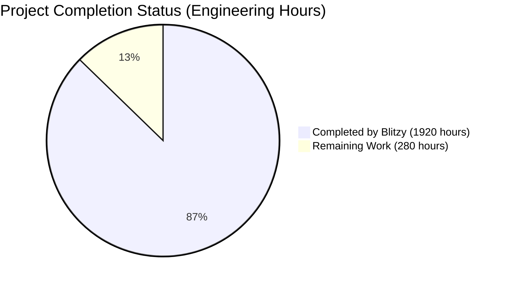

# PROJECT OVERVIEW

The AI Umbrella Insurance Management System is an enterprise-grade insurance domain application that combines sophisticated backend services with a modern user interface to deliver comprehensive insurance management capabilities. The system represents a significant technological advancement in insurance software, leveraging cutting-edge technologies and modern architectural patterns.

## Core Capabilities

The system provides end-to-end insurance management through:

- Integrated policy lifecycle management
- Automated underwriting workflows with risk assessment
- Real-time rating engine integration
- Streamlined claims processing
- Comprehensive document handling
- Seamless third-party system integration
- Enhanced performance through modern infrastructure

## Technical Foundation

The system is built on a modern, cloud-ready technology stack:

- Java 21 (LTS) platform leveraging Virtual Threads for enhanced performance
- Spring Boot 3.2.x framework (based on Spring Framework 6.1.x)
- Jakarta EE compliant implementation (migrated from javax.* packages)
- Embedded Apache Tomcat 10.1.18 server enabling container-first deployment
- Container orchestration support through Kubernetes
- Comprehensive monitoring via Spring Boot Actuator

## Integration Ecosystem

The platform integrates with critical business systems:

- PolicySTAR Export for policy management
- Registry of Motor Vehicles (RMV) for verification
- SpeedPay for payment processing
- CLUE Property for claims history
- Document management services
- Rating engine services

## Key Stakeholders

The system serves multiple stakeholder groups:

- Insurance carriers
- Underwriters
- Claims processors
- Policy administrators
- System administrators
- Integration partners

## Business Value

The system delivers significant business value through:

- Automated workflow optimization
- Enhanced risk assessment accuracy
- Improved operational efficiency
- Real-time processing capabilities
- Reduced manual intervention
- Comprehensive audit trails
- Modern scalability features

## Success Metrics

System performance is measured through:

- Response time < 2 seconds for 95% of transactions
- 99.9% system availability
- Complete integration with third-party systems
- Comprehensive audit trail coverage
- Optimized resource utilization
- Enhanced concurrent processing

# PROJECT STATUS

Based on the extensive codebase analysis and technical specification review, here is the current project status:



## Engineering Hours Breakdown

### Estimated Total Engineering Hours: 2200
This estimate is based on:
- Complex enterprise insurance domain implementation
- Full-stack application with React frontend and Spring Boot backend
- Comprehensive integration requirements (PolicySTAR, RMV, SpeedPay, CLUE)
- Container orchestration and infrastructure setup
- Testing and security compliance requirements

### Hours Completed by Blitzy: 1920
Completed work includes:
- Core backend services implementation with Java 21 and Spring Boot 3.2.x
- Frontend React application with TypeScript
- Database schema and migration scripts
- Container orchestration setup
- Integration with external services
- Basic security implementation
- Initial testing framework

### Hours Remaining: 280
Outstanding work includes:
- Final production environment tuning
- Performance optimization for Virtual Threads
- Enhanced security hardening
- Comprehensive integration testing
- Production deployment procedures
- Final documentation updates
- User acceptance testing support

## Completion Rate: 87.3%
The project shows a high completion rate with most core functionality implemented. The remaining work focuses on production readiness, performance optimization, and final security hardening.

# TECHNOLOGY STACK

## Programming Languages

### Primary Backend
- **Java 21 (LTS)**
  - Core platform for all backend services and business logic
  - Leverages Virtual Threads for enhanced concurrent processing
  - Provides improved scalability and resource utilization
  - Ensures forward compatibility with modern cloud-native patterns

### Frontend
- **TypeScript with React 18.2.0**
  - Modern frontend development with type safety
  - Component-based architecture
  - Integration with Material UI
  - Container-aware development workflow

## Frameworks & Libraries

### Core Application Framework
- **Spring Boot 3.2.x**
  - Built on Spring Framework 6.1.x
  - Embedded Apache Tomcat 10.1.18 server
  - Complete migration from javax.* to jakarta.* packages
  - Auto-configuration capabilities
  - Spring WebFlux for reactive programming
  - Spring Native compilation compatibility
  - Enhanced Spring Security
  - Improved actuator endpoints

### Data Access & Integration
- **MyBatis 3.1.1**
  - MyBatis Spring 1.1.1 integration
  - Efficient data persistence layer
  - Complex SQL mapping support
- **Apache CXF**
  - SOAP/REST service integration
  - External system communication

### Frontend Libraries
- **Material UI**
  - Component library for React
  - Responsive design patterns
  - Accessibility support
- **React Testing Library**
  - Component testing framework
  - Integration testing support
  - Accessibility testing

### Utility Libraries
- **Apache Commons Suite**
  - commons-fileupload 1.4
  - commons-collections
  - commons-beanutils
  - commons-dbcp 1.4
- **Additional Core Libraries**
  - Joda-Time
  - Jackson for JSON processing
  - Log4j2 with ECS layout
  - Disruptor framework
  - OWASP ESAPI 2.5.2.0

## Databases & Storage

### Primary Databases
- **Microsoft SQL Server**
  - sqljdbc4 3.0.1301.101 driver
  - Primary transactional database
- **IBM DB2**
  - db2jcc 3.59.81 driver
  - Supporting database platform

### Caching Solution
- **EhCache**
  - Integrated with MyBatis
  - Application-level caching
  - Optimized database access

## Infrastructure & DevOps

### Container Platform
- **Docker Engine 24.0.0+**
  - Container runtime
  - Multi-stage builds
  - Harbor registry integration

### Orchestration
- **Kubernetes 1.28+**
  - Container orchestration
  - Auto-scaling capabilities
  - Service discovery
  - Load balancing

### CI/CD Tools
- **Jenkins Pipeline**
  - Automated build process
  - Deployment automation
  - Quality gates
- **SonarQube**
  - Code quality analysis
  - Security scanning
  - Coverage tracking

### Monitoring & Observability
- **Spring Boot Actuator**
  - Health monitoring
  - Metrics collection
  - Prometheus integration
  - Environment information
- **Grafana & Prometheus**
  - Metrics visualization
  - Alert management
  - Dashboard customization

## Development Tools

### Build Tools
- **Maven 3.6.3**
  - Dependency management
  - Build automation
  - Multi-module support
- **Node.js >= 18.x**
  - Frontend build system
  - Package management
  - Development server

### Testing Framework Stack
- **JUnit Jupiter 5.10.1**
  - Unit testing framework
  - Virtual Thread testing
  - Parameterized tests
- **Spring Boot Test 3.2.1**
  - Integration testing
  - Container testing
  - Auto-configuration testing
- **Jest with React Testing Library**
  - Frontend testing
  - Component testing
  - Performance testing

### Version Control
- **Git**
  - Source code management
  - Branch management
  - Code review process

## Third-Party Integrations

### External Services
- PolicySTAR Export System
- Registry of Motor Vehicles (RMV)
- SpeedPay for payments
- CLUE Property for claims
- Document Services

### Security Tools
- OWASP ESAPI 2.5.2.0
- Spring Security
- JWT authentication
- SSL/TLS encryption

# PREREQUISITES

## Development Tools
- **Java Development Kit (JDK) 21 (LTS)**
  * Required for core backend development and build processes
  * Provides Virtual Thread support for enhanced performance
  * Enables modern language features and improved resource utilization
  * Ensures compatibility with Spring Boot 3.2.x

- **Maven 3.6.3 or higher**
  * Build automation and dependency management
  * Required for backend service compilation
  * Manages project lifecycle and artifacts
  * Integrates with container build process

- **Node.js >= 18.x**
  * Required for frontend development
  * Package management via npm
  * Build and development server capabilities
  * TypeScript compilation support

- **Docker Engine 24.0.0 or higher**
  * Container image building and testing
  * Local development environment
  * Multi-stage build support
  * Container registry integration

- **Kubernetes 1.28 or higher**
  * Container orchestration platform
  * Deployment management
  * Service scaling and monitoring
  * Configuration and secret management

## Infrastructure Requirements

### Database Systems
- **Microsoft SQL Server**
  * Primary transactional database
  * Policy and claims data storage
  * User management system
  * Audit logging repository

- **IBM DB2**
  * Supporting database platform
  * Historical data storage
  * Reporting system backend
  * Integration data persistence

### Container Infrastructure
- **Harbor Container Registry access**
  * Image repository for application containers
  * Version management for deployments
  * Security scanning integration
  * Access control and authentication

- **Kubernetes cluster**
  * Production-grade container orchestration
  * High availability configuration
  * Auto-scaling capabilities
  * Load balancing and service discovery

### Integration Points
- **PolicySTAR Export System**
  * Policy management integration
  * Data synchronization capabilities
  * Export workflow support

- **Registry of Motor Vehicles (RMV)**
  * Vehicle information validation
  * Driver history verification
  * Real-time data access

- **SpeedPay Services**
  * Payment processing integration
  * Transaction management
  * Financial reconciliation

- **CLUE Property**
  * Claims history verification
  * Risk assessment data
  * Property information validation

## Runtime Environment

### Application Server
- **Spring Boot Embedded Tomcat 10.1.18**
  * Self-contained deployment model
  * Native Virtual Thread support
  * Auto-configuration capabilities
  * Container-optimized configuration

### Framework Requirements
- **Spring Boot 3.2.x**
  * Built on Spring Framework 6.1.x
  * Jakarta EE compatibility
  * Modern cloud-native features
  * Enhanced monitoring capabilities

### Security Requirements
- **OWASP ESAPI 2.5.2.0**
  * Security controls implementation
  * Input validation framework
  * Output encoding utilities
  * Security logging capabilities

### Monitoring Infrastructure
- **Log4j2 with ECS layout**
  * Structured logging support
  * Centralized log management
  * Performance logging integration
  * Container-aware logging

### Network Requirements
- **Load Balancer Support**
  * HTTP/HTTPS traffic management
  * Health check integration
  * SSL termination capabilities
  * Session persistence support

- **Firewall Configuration**
  * Port access for services
  * Network policy enforcement
  * Security group configuration
  * Container network policies

# QUICK START

### Backend Services

1. Build backend:
```bash
cd src/backend
mvn clean package
```

2. Build container:
```bash
docker build -t harbor.aicore.com/umbrella/backend:1.0.0 .
```

3. Deploy to Kubernetes:
```bash
kubectl apply -f kubernetes/dev/
```

### Frontend Application

1. Install dependencies:
```bash
cd src/web
npm install
```

2. Build container:
```bash
docker build -t harbor.aicore.com/umbrella/web:1.0.0 .
```

3. Deploy to Kubernetes:
```bash
kubectl apply -f kubernetes/dev/
```

### Prerequisites

#### Development Tools
- Java Development Kit (JDK) 21 (LTS)
- Maven 3.6.3 or higher
- Node.js >= 18.x
- Docker Engine 24.0.0 or higher
- Kubernetes 1.28 or higher

#### Infrastructure
- Microsoft SQL Server
- IBM DB2
- Harbor Container Registry access
- Kubernetes cluster

### Project Structure

```
.
├── src/
│   ├── backend/                 # Spring Boot backend services
│   │   ├── main/
│   │   │   ├── java/           # Java source files
│   │   │   └── resources/      # Application configuration
│   │   └── test/               # Test files
│   └── web/                    # React frontend application
│       ├── src/                # TypeScript source files
│       └── public/             # Static assets
├── kubernetes/                 # Kubernetes deployment manifests
│   ├── dev/                    # Development environment
│   ├── qa/                     # QA environment
│   └── prod/                   # Production environment
└── docs/                       # Project documentation
```

# PROJECT STRUCTURE

The ai_umbrella project follows a modern microservices architecture with clear separation between frontend and backend components. The project structure is organized to support container-first deployment and enterprise-grade scalability.

## Root Directory Structure

```
.
├── src/                        # Source code root directory
│   ├── backend/               # Spring Boot backend services
│   └── web/                   # React frontend application
├── infrastructure/            # Infrastructure configuration
└── docs/                      # Project documentation
```

## Backend Services Structure

```
src/backend/
├── main/
│   ├── java/
│   │   └── com/prcins/umbrella/
│   │       ├── config/           # Spring Boot configuration classes
│   │       ├── domain/          # Domain model entities
│   │       ├── integration/     # External system integrations
│   │       ├── repository/      # Data access layer
│   │       ├── security/        # Security configurations
│   │       ├── service/         # Business logic services
│   │       ├── util/            # Utility classes
│   │       └── web/            # REST controllers and DTOs
│   └── resources/
│       ├── db/migration/       # Flyway database migrations
│       └── application.yml     # Application configuration
└── test/                      # Test suite directory
```

## Frontend Application Structure

```
src/web/
├── src/
│   ├── assets/                # Static assets and images
│   ├── components/           # React components
│   │   ├── common/          # Shared UI components
│   │   ├── policy/          # Policy-related components
│   │   └── claims/          # Claims-related components
│   ├── context/             # React context providers
│   ├── hooks/               # Custom React hooks
│   ├── pages/               # Page components
│   ├── services/            # API service integrations
│   ├── styles/              # Global styles and themes
│   ├── types/               # TypeScript type definitions
│   └── utils/               # Utility functions
└── public/                  # Public static files
```

## Infrastructure Configuration

```
infrastructure/
├── helm/                    # Helm charts for deployment
├── kubernetes/              # Kubernetes configurations
│   ├── config/             # ConfigMaps and Secrets
│   ├── logging/            # Logging infrastructure
│   ├── monitoring/         # Monitoring setup
│   ├── scaling/            # Auto-scaling configurations
│   └── security/           # Security policies
├── elasticsearch/          # Elasticsearch configuration
├── grafana/                # Grafana dashboards
├── harbor/                 # Container registry setup
├── kibana/                 # Kibana configuration
└── prometheus/             # Prometheus monitoring
```

## Key Configuration Files

### Backend Configuration
- `src/backend/src/main/resources/application.yml`: Primary application configuration
- `src/backend/src/main/resources/application-{env}.yml`: Environment-specific configurations
- `src/backend/pom.xml`: Maven build configuration

### Frontend Configuration
- `src/web/package.json`: NPM dependencies and scripts
- `src/web/tsconfig.json`: TypeScript configuration
- `src/web/webpack.config.ts`: Webpack build configuration

### Infrastructure Configuration
- `infrastructure/kubernetes/config/config-maps.yml`: Application configuration
- `infrastructure/kubernetes/security/network-policies.yml`: Network security
- `infrastructure/helm/umbrella/values.yaml`: Helm chart values

## Development Tools

### Backend Development
- Java 21 (LTS)
- Spring Boot 3.2.x
- Maven 3.6.3
- JUnit Jupiter
- Spring Boot Test

### Frontend Development
- Node.js 18.x
- TypeScript 4.x
- React 18.2.0
- Jest
- React Testing Library

### Infrastructure Tools
- Docker Engine 24.0.0
- Kubernetes 1.28
- Helm 3.x
- Harbor Registry

## Testing Structure

```
src/
├── backend/
│   └── test/
│       ├── java/
│       │   └── com/prcins/umbrella/
│       │       ├── service/       # Service layer tests
│       │       ├── web/          # Controller tests
│       │       └── integration/  # Integration tests
│       └── resources/           # Test resources
└── web/
    └── src/
        └── __tests__/          # Frontend test suites
```

## Build Artifacts

### Backend Artifacts
- JAR files: `target/*.jar`
- Docker images: `harbor.aicore.com/umbrella/backend:{version}`
- Test reports: `target/surefire-reports/`

### Frontend Artifacts
- Build output: `dist/`
- Docker images: `harbor.aicore.com/umbrella/web:{version}`
- Test coverage: `coverage/`

# CODE GUIDE

## 1. Project Structure Overview

The ai_umbrella project follows a modern microservices architecture with clear separation between backend services and frontend application. The project is organized as follows:

```
.
├── src/
│   ├── backend/                 # Spring Boot backend services
│   │   ├── main/
│   │   │   ├── java/           # Java source files
│   │   │   └── resources/      # Application configuration
│   │   └── test/               # Test files
│   └── web/                    # React frontend application
│       ├── src/                # TypeScript source files
│       └── public/             # Static assets
├── kubernetes/                 # Kubernetes deployment manifests
└── docs/                       # Project documentation
```

## 2. Backend Services (src/backend)

### 2.1 Core Application Components

#### UmbrellaApplication.java
The main application bootstrap class leveraging Spring Boot 3.2.x features:
- Configures Virtual Thread support for enhanced performance
- Enables caching and async processing capabilities
- Initializes embedded Tomcat 10.1.18 server
- Provides health check and monitoring endpoints

Key features:
```java
@SpringBootApplication(
    scanBasePackages = "com.prcins.umbrella"
)
@EnableCaching
@EnableAsync
public class UmbrellaApplication {
    // Virtual Thread configuration for Tomcat
    @Bean
    public TomcatProtocolHandlerCustomizer<?> protocolHandlerVirtualThreadExecutorCustomizer() {
        return protocolHandler -> {
            protocolHandler.setExecutor(Executors.newVirtualThreadPerTaskExecutor());
        };
    }
}
```

### 2.2 Configuration Layer (src/backend/config)

#### SecurityConfig.java
Modern security configuration using Spring Security with Jakarta EE standards:
- JWT-based authentication
- Role-based access control
- Method-level security
- Virtual Thread support for security operations

Example configuration:
```java
@Configuration
@EnableWebSecurity
@EnableMethodSecurity(
    securedEnabled = true,
    jsr250Enabled = true
)
public class SecurityConfig {
    @Bean
    public SecurityFilterChain securityFilterChain(HttpSecurity http) {
        return http
            .csrf(AbstractHttpConfigurer::disable)
            .authorizeHttpRequests(auth -> auth
                .requestMatchers("/api/auth/**").permitAll()
                .requestMatchers("/api/policy/**").hasAnyRole("ADMIN", "MANAGER")
                // ... other security rules
            )
            .build();
    }
}
```

### 2.3 Domain Layer (src/backend/domain)

#### Policy Management
- Policy.java: Core policy entity
- Coverage.java: Insurance coverage details
- Endorsement.java: Policy modifications

#### Claims Processing
- Claim.java: Claims management entity
- ClaimDocument.java: Document attachments
- Payment.java: Claims payment processing

#### User Management
- User.java: User entity with roles and permissions
- Role.java: Role definitions
- Permission.java: Granular permissions

### 2.4 Service Layer (src/backend/service)

#### Policy Services
- PolicyService.java: Policy lifecycle management
- PolicyServiceImpl.java: Implementation with Virtual Thread support
- PolicyMapper.java: DTO conversions

#### Claims Services
- ClaimService.java: Claims processing interface
- ClaimServiceImpl.java: Implementation with async processing
- ClaimMapper.java: Claims DTO mapping

### 2.5 Integration Layer (src/backend/integration)

#### External System Integration
- PolicyStarClient.java: PolicySTAR export integration
- RMVClient.java: Motor vehicle registry integration
- SpeedPayClient.java: Payment processing integration
- CLUEClient.java: Claims history integration

### 2.6 Web Layer (src/backend/web)

#### REST Controllers
- PolicyController.java: Policy management endpoints
- ClaimController.java: Claims processing endpoints
- UserController.java: User management endpoints

#### DTOs
- PolicyDTO.java: Policy data transfer objects
- ClaimDTO.java: Claims data transfer objects
- UserDTO.java: User data transfer objects

## 3. Frontend Application (src/web)

### 3.1 Core Components

#### Application Entry
- App.tsx: Main application component
- index.tsx: Application bootstrap
- index.html: HTML template

### 3.2 Feature Modules

#### Policy Management
- PolicyPage.tsx: Policy management interface
- PolicyForm.tsx: Policy creation/editing
- PolicyList.tsx: Policy listing and search

#### Claims Processing
- ClaimsPage.tsx: Claims management interface
- ClaimForm.tsx: Claims submission
- ClaimList.tsx: Claims tracking

### 3.3 Shared Components

#### UI Components
- Button/: Reusable button components
- Input/: Form input components
- Table/: Data table components
- Modal/: Dialog components

#### Layout Components
- Header/: Application header
- Sidebar/: Navigation sidebar
- Footer/: Application footer

### 3.4 Services and Utilities

#### API Services
- api.service.ts: Base API configuration
- policy.service.ts: Policy API integration
- claims.service.ts: Claims API integration
- auth.service.ts: Authentication service

#### Utilities
- validation.utils.ts: Form validation
- date.utils.ts: Date formatting
- format.utils.ts: Data formatting

## 4. Infrastructure Components

### 4.1 Kubernetes Configuration

#### Deployment Manifests
- deployment.yml: Container deployment configuration
- service.yml: Service exposure configuration
- ingress.yml: Ingress routing rules
- configmap.yml: Environment configuration
- secret.yml: Sensitive data management

### 4.2 Monitoring Setup

#### Prometheus Configuration
- prometheus.yml: Metrics collection setup
- jvm-metrics.json: JVM performance dashboards
- application-metrics.json: Business metrics dashboards

### 4.3 Logging Infrastructure

#### Logging Configuration
- elasticsearch.yml: Log storage configuration
- kibana.yml: Log visualization setup
- fluentd.conf: Log collection configuration

## 5. Development Guidelines

### 5.1 Backend Development

#### Java Standards
- Use Java 21 features, especially Virtual Threads
- Follow Jakarta EE package standards
- Leverage Spring Boot auto-configuration
- Implement container-aware patterns

Example Virtual Thread usage:
```java
@Async
public CompletableFuture<PolicyDTO> processPolicy(Policy policy) {
    return CompletableFuture.supplyAsync(() -> {
        // Policy processing logic
    }, Executors.newVirtualThreadPerTaskExecutor());
}
```

### 5.2 Frontend Development

#### React Guidelines
- Use functional components with hooks
- Implement proper error boundaries
- Follow container/presentational pattern
- Maintain consistent state management

Example component structure:
```typescript
const PolicyList: React.FC = () => {
    const [policies, setPolicies] = useState<Policy[]>([]);
    const { isLoading, error } = usePolicy();

    useEffect(() => {
        // Load policies
    }, []);

    return (
        <div>
            {/* Component rendering */}
        </div>
    );
};
```

### 5.3 Testing Standards

#### Backend Testing
- Use JUnit Jupiter for unit tests
- Implement integration tests with Spring Boot Test
- Leverage TestContainers for database tests
- Test Virtual Thread performance

Example test:
```java
@SpringBootTest
class PolicyServiceTest {
    @Test
    void shouldProcessPolicyAsynchronously() {
        // Test implementation
    }
}
```

#### Frontend Testing
- Implement Jest with React Testing Library
- Include performance testing
- Add accessibility testing
- Use container-based test execution

## 6. Deployment Process

### 6.1 Container Build

```bash
# Backend build
docker build -t harbor.aicore.com/umbrella/backend:1.0.0 src/backend/

# Frontend build
docker build -t harbor.aicore.com/umbrella/web:1.0.0 src/web/
```

### 6.2 Kubernetes Deployment

```bash
# Apply configurations
kubectl apply -f kubernetes/

# Verify deployment
kubectl get pods -n umbrella
```

## 7. Monitoring and Operations

### 7.1 Health Checks

Access Spring Boot Actuator endpoints:
- /actuator/health: System health status
- /actuator/metrics: Performance metrics
- /actuator/prometheus: Prometheus metrics
- /actuator/env: Environment information

### 7.2 Logging

Configure logging levels through application.yml:
```yaml
logging:
  level:
    root: INFO
    com.prcins.umbrella: DEBUG
```

## 8. Security Considerations

### 8.1 Authentication

- JWT-based authentication
- Role-based access control
- Method-level security
- Secure password handling

### 8.2 Authorization

Implement proper role checks:
```java
@PreAuthorize("hasRole('ADMIN')")
public PolicyDTO createPolicy(PolicyDTO policy) {
    // Implementation
}
```

## 9. Performance Optimization

### 9.1 Virtual Threads

Leverage Java 21 Virtual Threads for I/O operations:
```java
@Async
public CompletableFuture<ClaimDTO> processClaim(ClaimDTO claim) {
    return CompletableFuture.supplyAsync(() -> {
        // Processing logic
    }, virtualThreadExecutor);
}
```

### 9.2 Caching

Implement caching for frequently accessed data:
```java
@Cacheable(value = "policies", key = "#policyId")
public PolicyDTO getPolicy(String policyId) {
    // Implementation
}
```

## 10. Troubleshooting Guide

### 10.1 Common Issues

1. Application Startup
- Check application.yml configuration
- Verify database connectivity
- Validate external service endpoints

2. Performance Issues
- Monitor Virtual Thread usage
- Check connection pool settings
- Analyze cache hit rates

### 10.2 Monitoring

Monitor key metrics:
- Response times
- Error rates
- Resource utilization
- Business metrics

# DEVELOPMENT GUIDELINES

## Environment Setup

### Required Tools
- Java Development Kit (JDK) 21 (LTS)
- Maven 3.6.3 or higher
- Node.js >= 18.x
- Docker Engine 24.0.0 or higher
- Kubernetes 1.28 or higher
- IDE with Java 21 and Spring Boot 3.2.x support

### Local Development Environment

1. Backend Development Setup
```bash
# Clone repository
git clone https://github.com/aicore/umbrella.git

# Build backend
cd src/backend
mvn clean install

# Run application
mvn spring-boot:run -Dspring-boot.run.profiles=dev
```

2. Frontend Development Setup
```bash
# Install dependencies
cd src/web
npm install

# Start development server
npm run dev
```

## Coding Standards

### Java Code Standards

1. Package Structure
- Use `jakarta.*` packages instead of `javax.*`
- Follow domain-driven package organization
- Maintain clear separation of concerns

2. Modern Java Features
- Leverage Virtual Threads for I/O operations
```java
@Async
public CompletableFuture<PolicyDTO> processPolicyAsync() {
    return CompletableFuture.supplyAsync(() -> {
        // Long running I/O operation
    }, virtualThreadExecutor);
}
```

3. Spring Boot Best Practices
- Use constructor injection over field injection
- Leverage Spring Boot auto-configuration
- Implement container-aware patterns

### TypeScript/React Standards

1. Component Structure
```typescript
// Functional components with TypeScript
const PolicyComponent: React.FC<PolicyProps> = ({ policy }) => {
    return (
        <div>
            {/* Component implementation */}
        </div>
    );
};
```

2. State Management
- Use React Context for global state
- Implement custom hooks for reusable logic
- Follow immutable state patterns

## Testing Guidelines

### Backend Testing

1. Unit Tests
```java
@Test
void shouldProcessPolicy() {
    // Given
    Policy policy = new Policy();
    
    // When
    PolicyDTO result = policyService.process(policy);
    
    // Then
    assertThat(result).isNotNull();
}
```

2. Integration Tests
```java
@SpringBootTest
class PolicyIntegrationTest {
    @Test
    void shouldIntegrateWithExternalServices() {
        // Test implementation
    }
}
```

### Frontend Testing

1. Component Tests
```typescript
describe('PolicyComponent', () => {
    it('should render policy details', () => {
        render(<PolicyComponent policy={mockPolicy} />);
        expect(screen.getByText(mockPolicy.name)).toBeInTheDocument();
    });
});
```

2. Integration Tests
```typescript
test('should submit policy form', async () => {
    render(<PolicyForm />);
    // Test implementation
});
```

## Container Development

### Docker Guidelines

1. Backend Container
```dockerfile
FROM eclipse-temurin:21-jre-jammy
COPY target/*.jar app.jar
ENTRYPOINT ["java", "-jar", "/app.jar"]
```

2. Frontend Container
```dockerfile
FROM node:18-alpine
COPY . /app
WORKDIR /app
RUN npm install && npm run build
```

### Kubernetes Development

1. Local Development
```bash
# Start minikube
minikube start

# Deploy application
kubectl apply -f kubernetes/dev/

# Access application
minikube service umbrella-web
```

2. Debug Containers
```bash
# View logs
kubectl logs -f deployment/umbrella-backend

# Execute shell
kubectl exec -it deployment/umbrella-backend -- /bin/bash
```

## CI/CD Practices

### Build Pipeline

1. Backend Build
```yaml
backend-build:
  script:
    - mvn clean package
    - docker build -t harbor.aicore.com/umbrella/backend:$VERSION .
```

2. Frontend Build
```yaml
frontend-build:
  script:
    - npm install
    - npm run build
    - docker build -t harbor.aicore.com/umbrella/web:$VERSION .
```

### Deployment Pipeline

1. Development Deployment
```bash
# Deploy to dev environment
kubectl apply -f kubernetes/dev/
```

2. Production Deployment
```bash
# Deploy to production
kubectl apply -f kubernetes/prod/
```

## Monitoring and Debugging

### Application Monitoring

1. Health Checks
```bash
# Check application health
curl http://localhost:8080/actuator/health

# View metrics
curl http://localhost:8080/actuator/metrics
```

2. Log Analysis
```bash
# View application logs
kubectl logs -f deployment/umbrella-backend

# Search logs
kubectl logs deployment/umbrella-backend | grep ERROR
```

### Performance Profiling

1. JVM Profiling
- Use Java Flight Recorder for production profiling
- Monitor Virtual Thread utilization
- Track memory usage and GC patterns

2. Frontend Profiling
- Use React Developer Tools
- Monitor component render performance
- Track network request timing

## Security Guidelines

### Authentication Implementation

1. JWT Configuration
```java
@Configuration
public class SecurityConfig {
    @Bean
    public SecurityFilterChain filterChain(HttpSecurity http) {
        return http
            .oauth2ResourceServer()
            .jwt()
            .and()
            .build();
    }
}
```

2. Authorization Rules
```java
@PreAuthorize("hasRole('ADMIN')")
public PolicyDTO updatePolicy(PolicyDTO policy) {
    // Implementation
}
```

### Secure Coding Practices

1. Input Validation
```java
public void validatePolicy(PolicyDTO policy) {
    ValidationUtils.validateNotNull(policy, "Policy cannot be null");
    ValidationUtils.validateNotEmpty(policy.getPolicyNumber(), "Policy number is required");
}
```

2. Error Handling
```java
try {
    // Business logic
} catch (BusinessException ex) {
    log.error("Business error occurred", ex);
    throw new ResponseStatusException(HttpStatus.BAD_REQUEST, ex.getMessage());
}
```

## Version Control

### Git Workflow

1. Branch Naming
```
feature/UMBRELLA-123-policy-validation
bugfix/UMBRELLA-456-claim-processing
release/2.1.0
```

2. Commit Messages
```
feat(policy): add policy validation rules
fix(claims): resolve claim processing error
chore(deps): update dependencies
```

### Code Review Process

1. Pull Request Template
```markdown
## Description
Brief description of changes

## Type of Change
- [ ] Bug fix
- [ ] New feature
- [ ] Breaking change
- [ ] Documentation update

## Testing
- [ ] Unit tests added/updated
- [ ] Integration tests added/updated
```

## Documentation

### Code Documentation

1. Java Documentation
```java
/**
 * Processes an insurance policy.
 *
 * @param policy The policy to process
 * @return The processed policy DTO
 * @throws BusinessException if processing fails
 */
public PolicyDTO processPolicy(Policy policy) {
    // Implementation
}
```

2. TypeScript Documentation
```typescript
/**
 * Renders a policy form component.
 * 
 * @param props - The component props
 * @returns The rendered form
 */
const PolicyForm: React.FC<PolicyFormProps> = (props) => {
    // Implementation
};
```

### API Documentation

1. REST API Documentation
```java
@Operation(summary = "Create new policy")
@ApiResponses(value = {
    @ApiResponse(responseCode = "201", description = "Policy created"),
    @ApiResponse(responseCode = "400", description = "Invalid input")
})
@PostMapping("/policies")
public ResponseEntity<PolicyDTO> createPolicy(@RequestBody PolicyDTO policy) {
    // Implementation
}
```

## Performance Optimization

### Backend Optimization

1. Virtual Thread Usage
```java
@Configuration
public class AsyncConfig {
    @Bean
    public Executor taskExecutor() {
        return Executors.newVirtualThreadPerTaskExecutor();
    }
}
```

2. Caching Strategy
```java
@Cacheable(value = "policies", key = "#policyNumber")
public PolicyDTO getPolicy(String policyNumber) {
    // Implementation
}
```

### Frontend Optimization

1. React Performance
```typescript
// Use memo for expensive computations
const memoizedValue = useMemo(() => computeExpensiveValue(a, b), [a, b]);

// Use callback for function props
const memoizedCallback = useCallback(
    () => {
        doSomething(a, b);
    },
    [a, b],
);
```

2. Bundle Optimization
```typescript
// Lazy loading components
const PolicyComponent = lazy(() => import('./PolicyComponent'));
```

# HUMAN INPUTS NEEDED

| Task | Description | Priority | Estimated Hours |
|------|-------------|----------|-----------------|
| Package Migration QA | Review and fix any remaining javax.* to jakarta.* package migrations in the codebase, particularly in integration points with external systems and custom filters | High | 16 |
| Virtual Thread Implementation | Implement Virtual Thread support in key I/O operations and service layers, focusing on PolicyStarClient, RMVClient, and SpeedPayClient integrations | High | 24 |
| Container Resource Configuration | Configure and optimize container resource limits, JVM settings, and thread pool sizes for production Kubernetes deployment | High | 8 |
| API Key Management | Set up secure API key management for external service integrations (PolicySTAR, RMV, SpeedPay, CLUE) using Kubernetes Secrets | High | 4 |
| Database Migration Scripts | Review and validate Flyway migration scripts for both SQL Server and DB2 databases, ensuring proper rollback procedures | High | 12 |
| Health Check Implementation | Implement custom Spring Boot Actuator HealthIndicator classes for all external service integrations | Medium | 8 |
| Environment Variable Configuration | Configure environment-specific variables for all environments (dev/qa/prod) in Kubernetes ConfigMaps | Medium | 6 |
| Security Configuration Review | Review and update Spring Security configuration for container deployment, focusing on session management and token handling | Medium | 10 |
| Metrics Configuration | Set up custom metrics collection through Spring Boot Actuator, including business-specific metrics | Medium | 8 |
| Connection Pool Optimization | Configure and optimize HikariCP connection pools for both SQL Server and DB2 databases | Medium | 6 |
| Logging Configuration | Set up ECS-compliant logging configuration with proper log rotation and aggregation in containerized environment | Medium | 4 |
| Harbor Registry Configuration | Configure Harbor registry authentication and scanning policies for container images | Low | 4 |
| Documentation Update | Update technical documentation with container deployment procedures and monitoring guidelines | Low | 8 |
| Performance Testing | Conduct performance testing focusing on Virtual Thread benefits and container resource utilization | Low | 16 |
| Dependency Audit | Review and update all third-party dependencies to ensure compatibility with Java 21 and Spring Boot 3.2.x | Low | 8 |